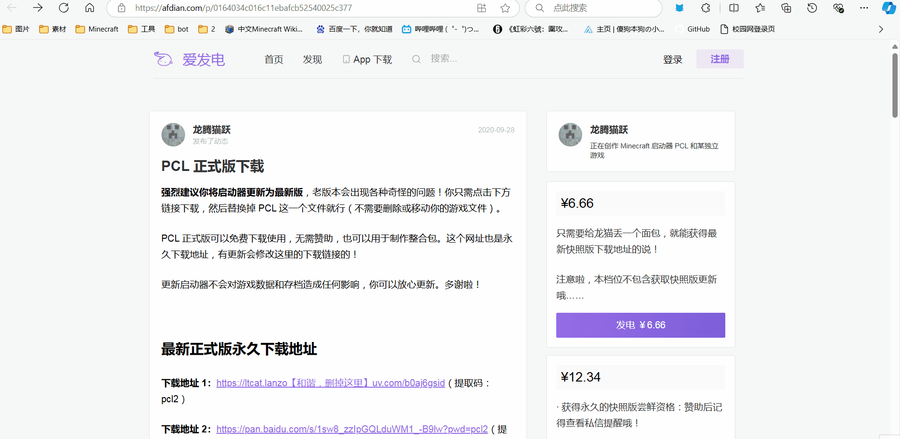
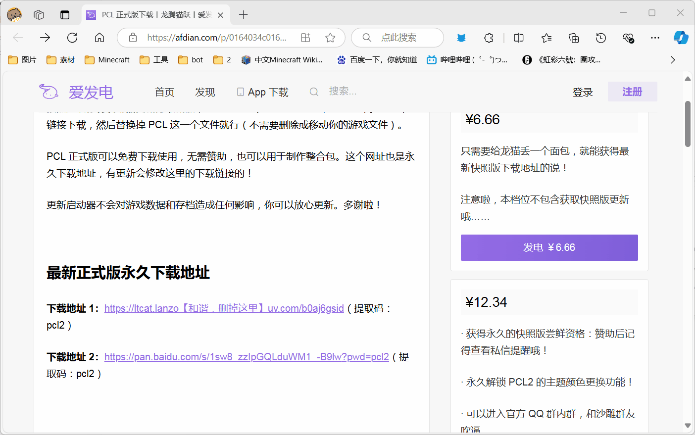
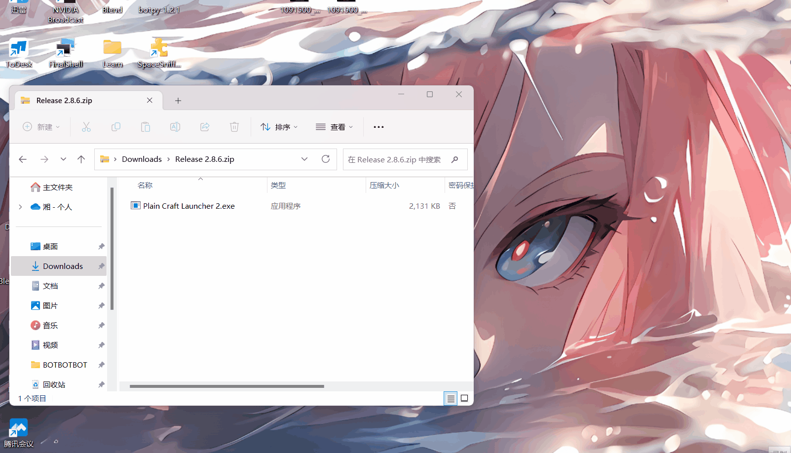

# 准备工作 - 选择并安装启动器

- #### 主流启动器推荐（推荐使用PCL2）

##### 	PCL 2：https://afdian.com/p/0164034c016c11ebafcb52540025c377

##### 	HMCL：https://hmcl.huangyuhui.net/download/

- #### PCL2安装教程：

​	打开PCL2作者主页后 选择一个你喜欢的下载链接

​	建议下载完成后在电脑桌面或者其他位置创建一个文件夹，将里面的文件放你新建的文件夹内

- #### HMCL安装教程：

​	稍安勿躁...稍后就给客官呈上