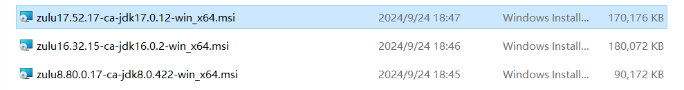
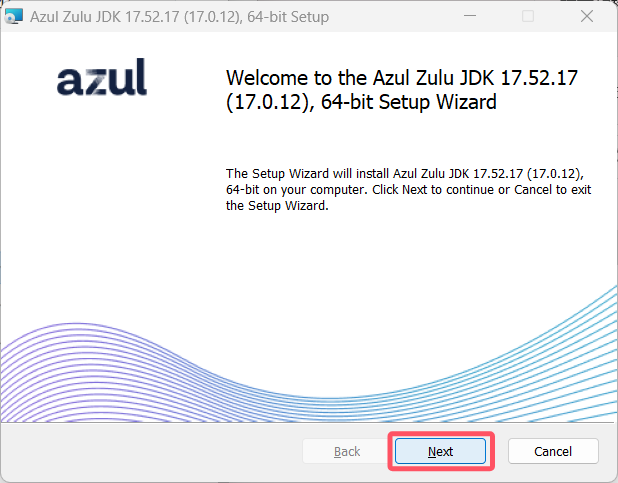
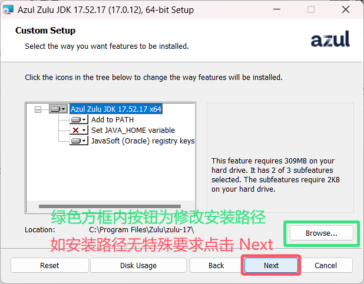
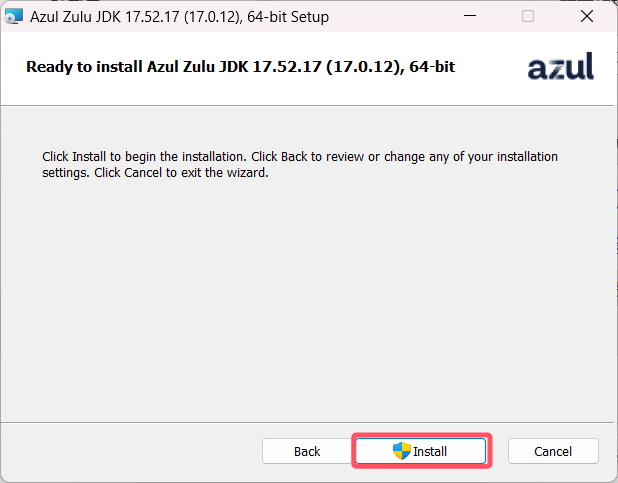
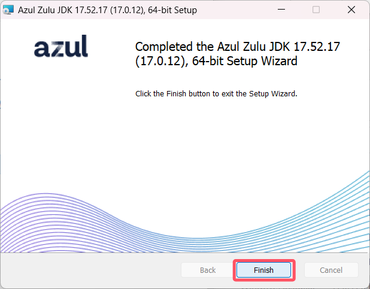

# 准备工作 - 选择并安装JAVA

##### ~~Java是游戏必须的，别问为什么，你问为什么那我问你为什么这版本叫java版😡~~

- #### 选择你的java版本

不同的版本对应不同的java，按自己所需的游戏版本下载java

| 游戏版本  | JAVA版本 | 下载地址                                                     |
| --------- | -------- | ------------------------------------------------------------ |
| 1.12-1.16 | java8    | [点击下载](https://www.azul.com/core-post-download/?endpoint=zulu&uuid=e40e9686-3de2-49f2-8edf-f81e7dfb09e7) |
| 1.17+     | java16+  | [点击下载](https://www.azul.com/core-post-download/?endpoint=zulu&uuid=7e24efa5-590f-4c4c-b8a7-20b2cb352da4) |
| 1.18+     | java17+  | [点击下载](https://www.azul.com/core-post-download/?endpoint=zulu&uuid=a079eeee-820e-4248-bc27-b497484d014e) |
| 1.20.5+   | java21   | [点击下载](https://www.azul.com/core-post-download/?endpoint=zulu&uuid=65837842-676c-4875-a9b4-461acd0b1440) |

- #### 安装java (我这里以17为例)

打开后点击 Next - Next - Install - Finish

到这里你的java就已经安装好了，你可以进入下一步了

---------------------------------------------------------------------------

感兴趣或者有需求的可以了解一下这个视频

通过优化java运行环境来优化游戏 

https://www.bilibili.com/video/BV1M8411i7gi/

