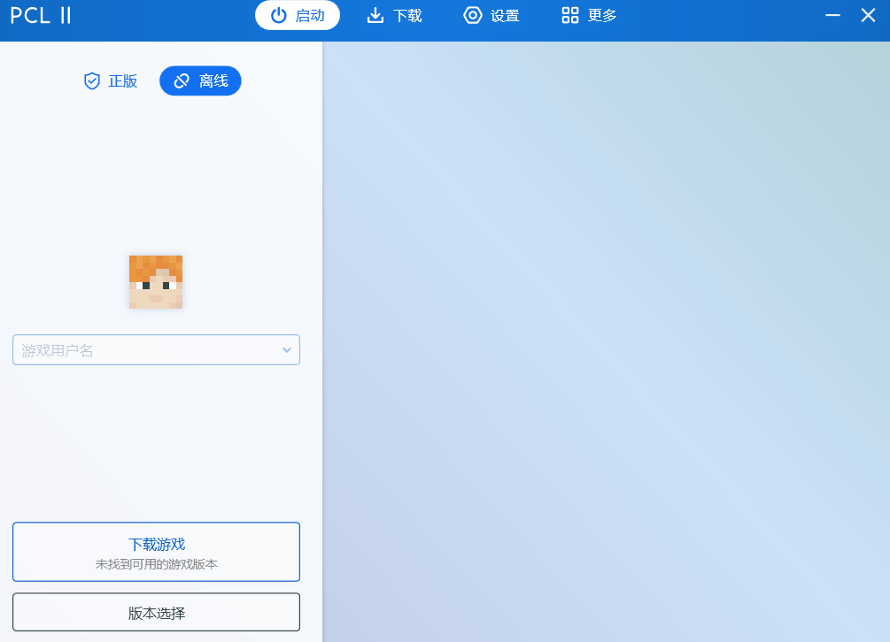

# 安装游戏

打开PCL启动器

### 0.开启版本隔离

建议你先前往“设置” → “开启版本隔离” 再回到启动界面，进行后续的操作

### 1.设置游戏名称 (注册账号)

在启动界面我们切换到“离线”模式，然后输入你的游戏名称（只能是数字/字母/下划线）

### 2.下载游戏

点击屏幕上方的“下载“进入下载界面

然后选择你想要的版本（这里我们安装最新版本为例），然后点击开始安装

如果你想后续添加模组、光影材质等 请在安装之前选择Fabric 然后再点开始安装

安装速度取决于你的设备情况，请稍安勿躁

安装完成后 点击回到”启动界面“点击启动游戏即可开始游玩

