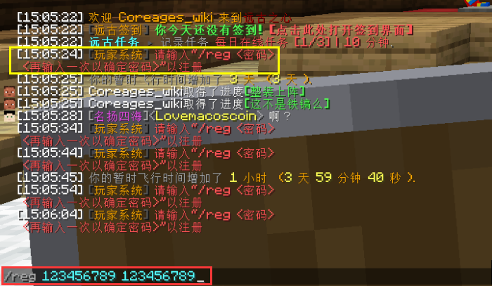
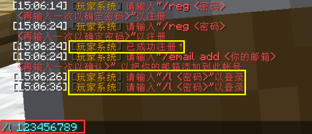
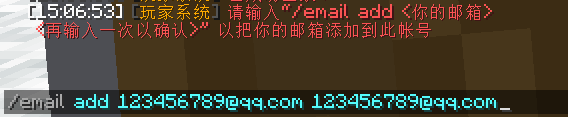

# 新手指引 - 注册账号

> 欢迎来到远古之心！开始你的旅行吧！

进入服务器第一件事即是注册账号

1.打开聊天栏 使用指令 `/reg <密码> <再次输入密码>` 注册账号  **不要设置太简单的密码**

2.账号注册完成后需登录账号 `/l <密码>`   **不能是大写的L**

3.请务必绑定邮箱以便找回密码 `/email add <邮箱> <再次输入邮箱>`

4.修改密码请使用指令`/changepass <旧密码> <新密码>`

​					**恭喜你完成了注册 现在开始你的旅行吧！**
