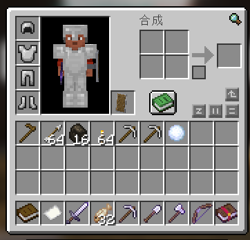

# 新手礼包

### 1.**权限：**

3天飞行，免费圈地

### 2.**物品：**

远古之心菜单、远古之心Coreages食用说明、Slimefun指南、远古饰品菜单

铁套、铁镐x3、铁斧、铁锄、铁铲、弓、木锄头(圈地工具)、箭x64、香喷喷的烤鱼x32、木炭x16、火把x16

**装备附魔如下：**

`铁剑 (锋利II、耐久III)` 

`铁镐 (效率III，时运II、耐久III)`

`铁铲 (效率III、耐久III)`

`铁斧 (效率III、耐久III)`

`弓 (耐久III)`
