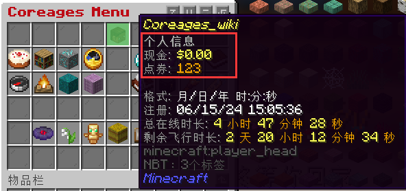
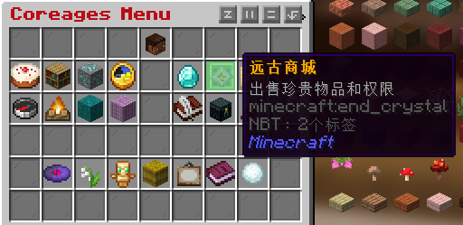
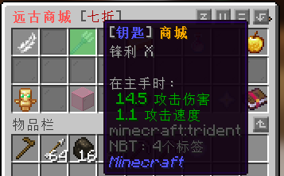

# 货币系统和钥匙商城

### 1.货币系统

打开菜单 将鼠标放在上方头颅即可看到自己的货币

**现金：** 服务器的游戏币，可以在系统商店买卖物品以及和玩家交易

**点券：**充值比例 1：100 使用指令 `/mc` 打开充值界面 可用于购买权限，抽奖箱，升级生命值等

### 2.钥匙商店 内容正在完善中

菜单 → 远古商城 → 钥匙商城

| 抽奖箱 | 价格          | 可开出的物品                                     |
| ------ | ------------- | ------------------------------------------------ |
| 补给箱 | 1200现金 / 个 |                                                  |
| 装备箱 | 500点券 / 个  | 提升30级，远古套，水晶[加强]套，玄铁套，远古盾牌 |
| 武器箱 | 500点券 / 个  |                                                  |
| 工具箱 | 500点券 / 个  |                                                  |
| 远古箱 | 4500点券 / 个 | 必得远古装备                                     |

`中奖概率 ： 此奖品权重/此箱子内所有奖品权重之和`

##### **粘液科技宝箱 - 500点券 / 个**

权重5：粉尘制造机

权重8：起泡锭x16

权重10：辐射太阳能发电机

权重15：可授权可编程式机器人(普通)、充能GPS发射器、高能太阳能发电机、强化合金锭x16

权重20：高级可编程机器人(普通)、黑金刚石GPS发射器、黑金刚镶边储能电容、充能太阳能发电机

权重25：可编程机器人(普通)、GPS地形扫描器、原油泵、月光发电机

##### **宝石宝箱 - 1000点券 / 个**

权重5：无限 [可以使装备/武器获得无限耐久]

权重15：时运

权重20：冲击、击退、海之眷顾

权重25：锋利、力量、节肢杀手、亡灵杀手、效率、横扫之刃、弹射物/火焰/摔落保护/爆炸保护、保护、饵钩、抢夺、荆棘

权重40：耐久

##### **刷怪笼宝箱 - 1500点券 / 个**

权重5：村民 (仅可抽中一次)

权重10：史莱姆、凋零骷髅

权重15：苦力怕、牛、僵尸猪人、女巫

权重20：骷髅、守卫者

权重25：僵尸

