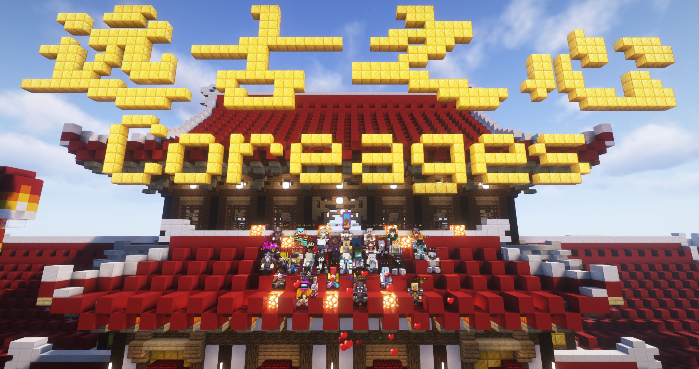
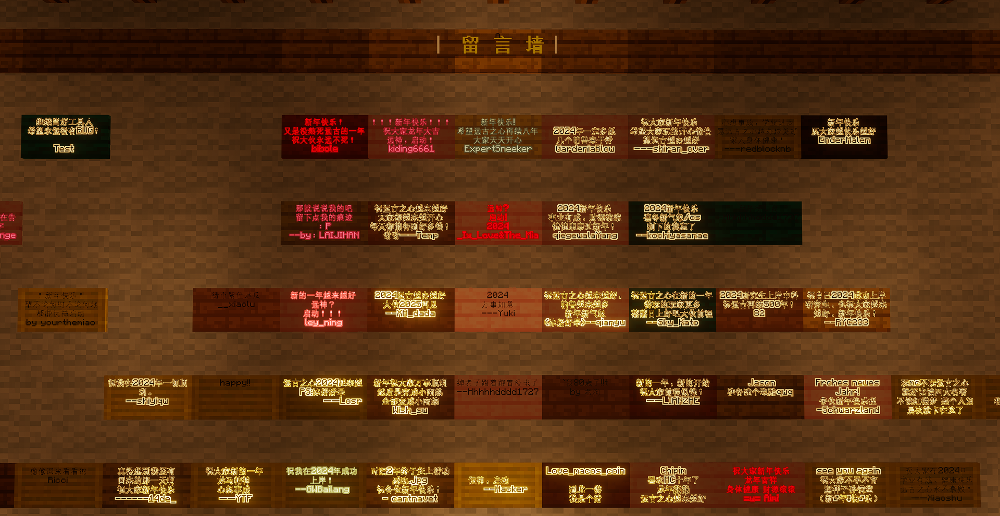
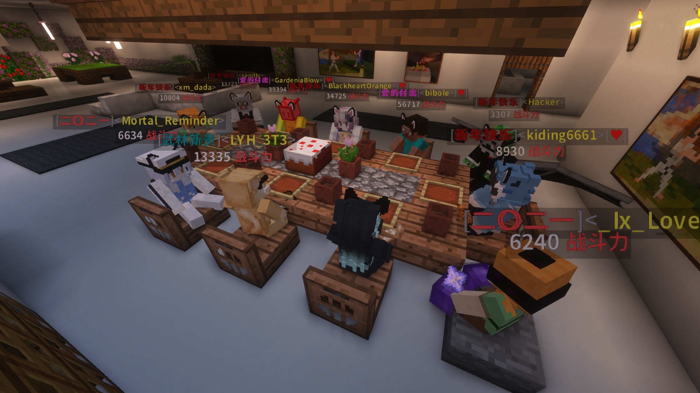
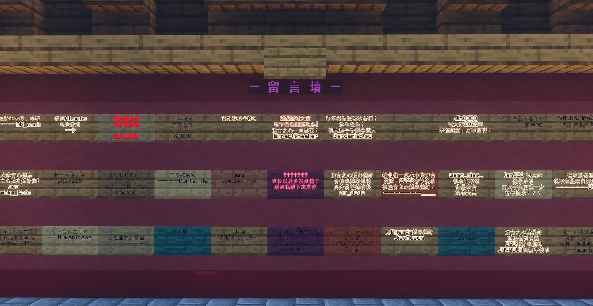
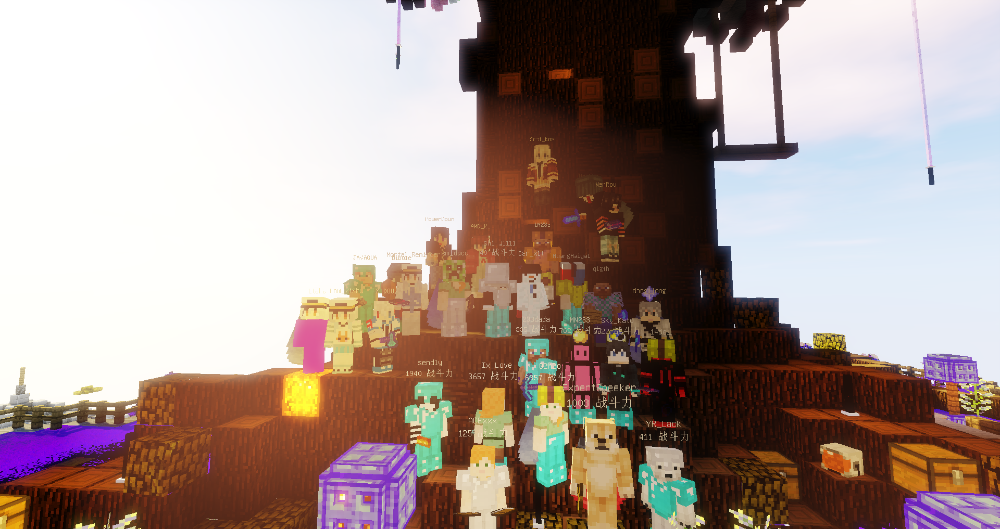
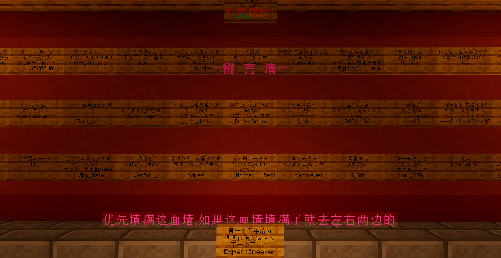
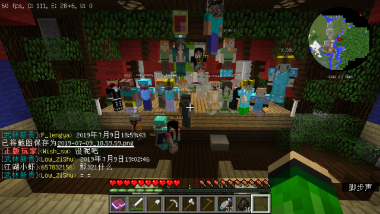

# 服务器简介

**Hello! Coreages！**

**远古之心是由老狗-ExpertSneeker负责维护管理的免费的无需正版验证的Minecraft Java Edition & Minecraft Bedrock Edition 多人游戏服务器。**

**服务器于2018年8月开服，是以原版生存+粘液科技玩法为主的服务器。**

**今天加入我们，尝试我们的游戏模式，让您体验宾至如归的感受！**

------

**游戏版本:** 

​	JAVA版：1.9~1.21 [ 推荐1.21 ] 

​	基岩版：1.20.40-1.20.73

**服务器地址/IP：**

​	JAVA版：

​		服务器地址： `coreages.com` 

​		单线地址： 

​		电信：`dx.coreages.com` 

​		联通：`lt.coreages.com` 

​		移动：`yd.coreages.com` 

​	基岩版：

​		服务器地址: `be.coreages.com` 端口: `34655`

​	通用备用IP: `owl12.imxbt.cn:34655` 

------

教程文档: [https://wiki.coreages.com/](https://wiki.coreages.com/ ) 

QQ群：[902294518](https://qm.qq.com/q/RXH536hWso) 

Discord：[https://discord.gg/XeHDsnVY2B](https://discord.gg/XeHDsnVY2B)

------

##### 服务器截图：**[点我查看更多](Coreages4.md)**

