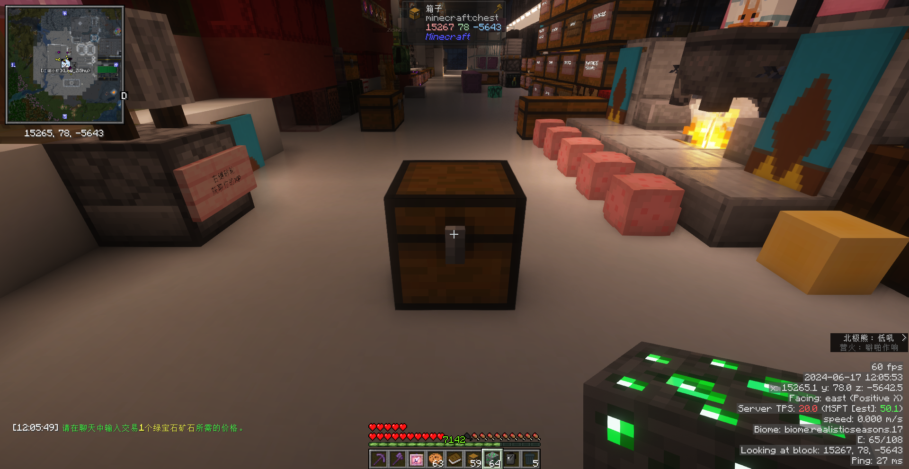
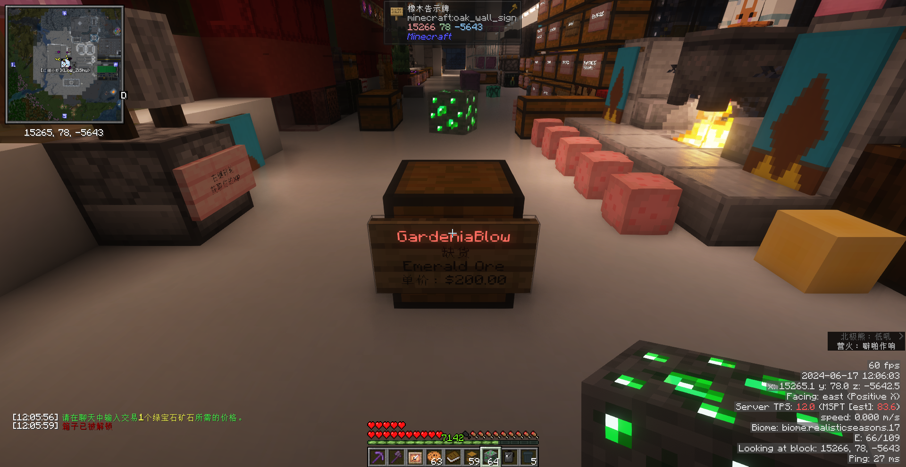
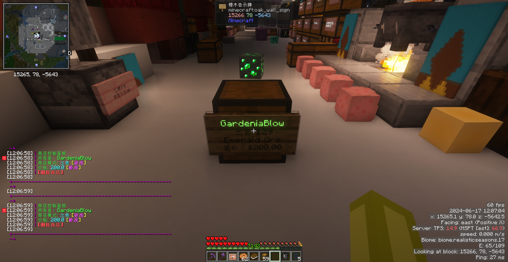
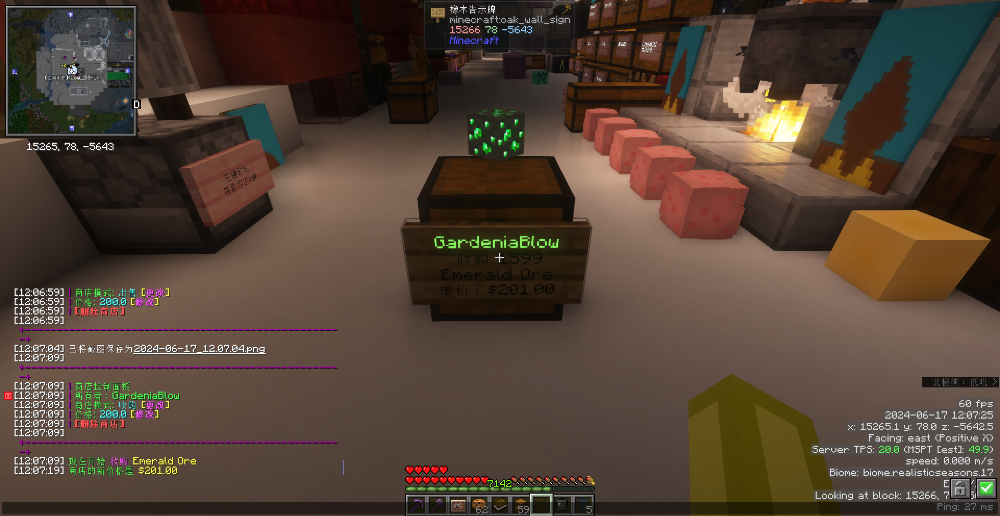
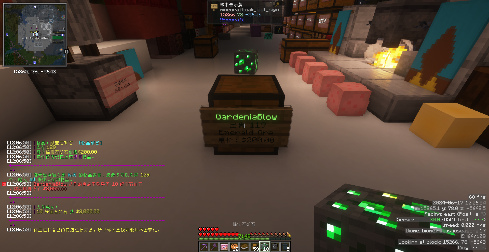

# 箱子商店

买卖物品时请各位玩家合理定价，不要破坏市场。

### 你是卖家

##### 创建箱子商店

放置一个箱子，手拿你需要交易的物品，左键箱子后，打开聊天栏输入你要交易的价格，即可完成箱子商店的创建。

##### 修改箱子商店的价格和交易模式

右键箱子商店的告示牌，聊天栏会发送交互面板给你，打开聊天栏使用鼠标进行互动。

你也可以对准箱子商店使用指令修改。

修改为出售模式：`/qs sell`

修改为收购模式：`/qs buy`

修改交易价格：`/qs price <价格>`

### 你是买家

##### 购买/出售物品

左键商店牌子，打开聊天栏输入你要交易的数量，即可完成交易。

