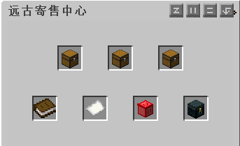
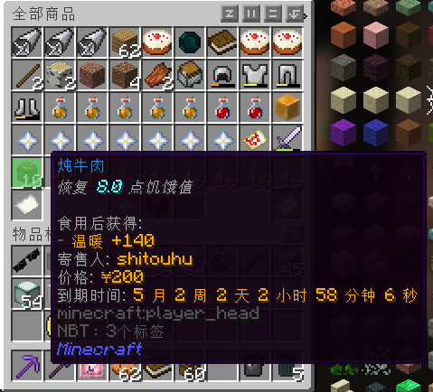
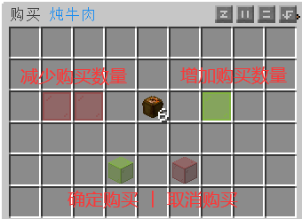

# 寄售中心

买卖物品时请各位玩家合理定价。

打开方法：指令`/ps` 或 `菜单 → 寄售中心`。

第一排三个箱子依次是`浏览店铺`、`浏览商品`、`浏览分类`。

第二排依次是`搜索店铺`、`搜索商品`、`我的店铺`、`未领取的物品`。

### 你是买家

通过`浏览店铺`、`浏览商品`、`浏览分类`、`搜索店铺`、`搜索商品`找到你需要购买的物品。

点击你要购买的物品，然后选择你要购买的数量，确定购买。

交易成功后商品就在你的背包里。

### 你是卖家

手上拿着你需要寄售的物品，输入指令`/js <数量> <价格>`。

如下图，我寄售了10个绿宝石原矿，售价为2000。

可在`我的店铺`查看和取消你寄售的物品。

取消寄售后的物品需要自行去`未领取的物品`领取。

如果物品超过180天无人购买，物品将会自动退回到`未领取的物品`。

