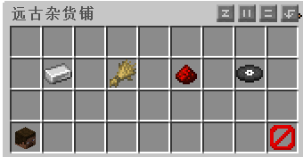

# 系统商店

服务器官方商店，价格固定，出售/收购数量无限。

打开方法：`菜单→远古杂货铺 `或 指令`/s`。

### 购买/出售物品

购买：选择分类→选择要购买的物品→选择购买数量→确认购买。

出售：使用指令`/sa`可以一键售卖背包内可售卖的物品。

### 物品价格表

请以服务器的实际价格为准。

#### 矿物类

|      物品      | 出售价格 | 收购价格 |
| :------------: | :------: | :------: |
|    紫水晶块    |   0.48   |   0.12   |
|   紫水晶碎片   |   0.40   |   0.10   |
|  下届合金碎片  |   160    |    40    |
|      煤炭      |    1     |    1     |
|     煤炭块     |    9     |    9     |
|     粗铜块     |    18    |   4.50   |
|      粗铜      |    2     |   0.50   |
|    钻石矿石    |   100    |    25    |
|   绿宝石矿石   |   200    |    50    |
|     粗金块     |  154.80  |  38.70   |
|      粗金      |  17.20   |   4.30   |
|     粗铁块     |    18    |   4.50   |
|      粗铁      |    2     |   0.50   |
|    青金石块    |    18    |   4.50   |
|     青金石     |    2     |   0.50   |
|    下届石英    |   0.10   |   0.05   |
|     石英块     |   0.40   |   0.20   |
|  深层钻石矿石  |   100    |    25    |
| 深层绿宝石矿石 |   200    |    50    |

#### 农业类

|   物品   | 出售价格 | 收购价格 |
| :------: | :------: | :------: |
|   竹子   |   0.12   |   0.03   |
|   蜂巢   |  不出售  |    10    |
|   蜂箱   |    20    |  不收购  |
|  甜菜根  |   0.60   |   0.15   |
| 甜菜种子 |   0.40   |   0.10   |
| 棕色蘑菇 |   0.80   |   0.20   |
|  仙人掌  |   0.10   |   0.03   |
|  胡萝卜  |   0.60   |   0.15   |
|  紫颂花  |   0.40   |   0.10   |
|  紫颂果  |    1     |   0.25   |
|  可可豆  |   0.80   |   0.20   |
|  绯红菌  |   1.20   |   0.30   |
|   鸡蛋   |    1     |   0.25   |
|   海带   |   0.10   |   0.03   |
|   皮革   |    8     |    2     |
|   西瓜   |   1.80   |   0.45   |
| 西瓜种子 |   0.20   |   0.05   |
|  西瓜片  |   0.20   |   0.05   |
|  下届疣  |   0.60   |   0.15   |
|  马铃薯  |   0.60   |   0.15   |
|   南瓜   |   1.40   |   0.35   |
| 南瓜种子 |   0.32   |   0.08   |
| 红色蘑菇 |   0.50   |   0.20   |
|   甘蔗   |   0.10   |   0.03   |
|  诡异菌  |   1.20   |   0.30   |
|   小麦   |   0.80   |   0.20   |
| 小麦种子 |   0.10   |   0.05   |

#### 红石类 （只出售，不收购）

|      物品      | 出售价格 |
| :------------: | :------: |
|     炼药锅     |    14    |
|   阳光探测器   |    20    |
|     发射器     |    10    |
|     投掷器     |    5     |
|      漏斗      |    15    |
|      铁门      |    12    |
|     唱片机     |    30    |
|      拉杆      |    1     |
|     避雷针     |    10    |
|     音符盒     |    5     |
|     侦测器     |    10    |
|     红石灯     |    2     |
|    红石火把    |    2     |
|     重生锚     |    80    |
|      标靶      |    20    |
|     绊线钩     |    5     |
|   红石比较器   |    8     |
|   红石中继器   |    6     |
|    橡木按钮    |   0.15   |
|    石头按钮    |   0.25   |
|      活塞      |    10    |
|    黏性活塞    |    15    |
|   橡木压力板   |   0.30   |
|   石头压力表   |   0.50   |
| 轻质侧重压力板 |    35    |
| 重质侧重压力板 |    5     |
|   橡木活板门   |    2     |
|    铁活板门    |    20    |
|     粘液球     |    5     |
|     红石粉     |   1.20   |
|     红石块     |  10.80   |

#### 唱片类 （只收购，不出售）[中文wiki-音乐唱片](https://zh.minecraft.wiki/w/%E9%9F%B3%E4%B9%90%E5%94%B1%E7%89%87?variant=zh-cn)

|           唱片类            | 收购价格 |
| :-------------------------: | :------: |
|          C418 - 11          |   400    |
|          C418 - 13          |   300    |
|      Samuel Aberg - 5       |   900    |
|        C418 - blocks        |   400    |
|         C418 - cat          |   300    |
|        C418 - chirp         |   400    |
|         C418 - far          |   400    |
|         C418 - mall         |   400    |
|       C418 - mellohi        |   400    |
|   Lena Raine - otherside    |   400    |
| C418 - Lena Raine - Pigstep |   600    |
|         C418 - stal         |   400    |
|        C418 - strad         |   400    |
|         C418 - wait         |   400    |
|         C418 - ward         |   400    |

