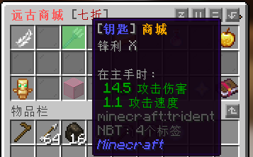

# 钥匙商城

### 1.价格表

|    抽奖箱    |     价格      |
| :----------: | :-----------: |
|    补给箱    | 1200现金 / 个 |
|    装备箱    | 500点券 / 个  |
|    武器箱    | 500点券 / 个  |
|    工具箱    | 500点券 / 个  |
|    远古箱    | 4500点券 / 个 |
| 粘液科技宝箱 | 500点券 / 个  |
|   宝石宝箱   | 1000点券 / 个 |
|  刷怪笼宝箱  | 1500点券 / 个 |

### 2.各类箱子的中奖内容

##### 补给箱

提升80级、水晶短剑、水晶战斧、水晶头盔、水晶胸甲、水晶护腿、水晶靴子、神奇的鱼竿、玄铁头盔、玄铁护甲、玄铁护腿、玄铁靴子、玄铁短剑、玄铁战斧、玄铁镐、玄铁斧、玄铁铲、玄采石镐、石中剑、桃木驱魔剑

##### 装备箱

提升30级、远古头盔、远古胸甲、远古护腿、远古靴子、水晶头盔[加强]、水晶胸甲[加强]、水晶护腿[加强]、水晶靴子[加强]、玄铁头盔、玄铁胸甲、玄铁护腿、玄铁靴子、远古盾牌

##### 武器箱

提升30级、远古战弓、远古神剑、远古战斧、乌木猎弓、水晶短剑[加强]、水晶战斧[加强]、玄铁短剑、玄铁战斧、石中剑、桃木驱魔剑、半自动加特林、咸鱼突刺

##### 工具箱

提升30级、远古之镐、远古之斧、远古之铲、远古采石镐、神奇的鱼竿、玄铁镐、玄铁斧、玄铁铲、玄铁采石镐

##### 远古箱

远古之镐、远古之斧、远古之铲、远古采石镐、半自动加特林、远古头盔、远古胸甲、远古护腿、远古靴子、远古盾牌

##### 粘液科技宝箱

权重5：粉尘制造机

权重8：起泡锭x16

权重10：辐射太阳能发电机

权重15：可授权可编程式机器人(普通)、充能GPS发射器、高能太阳能发电机、强化合金锭x16

权重20：高级可编程机器人(普通)、黑金刚石GPS发射器、黑金刚镶边储能电容、充能太阳能发电机

权重25：可编程机器人(普通)、GPS地形扫描器、原油泵、月光发电机

##### 宝石宝箱

权重5：无限 [可以使装备/武器获得无限耐久]

权重15：时运

权重20：冲击、击退、海之眷顾

权重25：锋利、力量、节肢杀手、亡灵杀手、效率、横扫之刃、弹射物/火焰/摔落保护/爆炸保护、保护、饵钩、抢夺、荆棘

权重40：耐久

##### 刷怪笼宝箱

权重5：村民 (仅可抽中一次)

权重10：史莱姆、凋零骷髅

权重15：苦力怕、牛、僵尸猪人、女巫

权重20：骷髅、守卫者

权重25：僵尸

