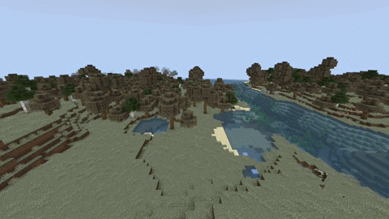
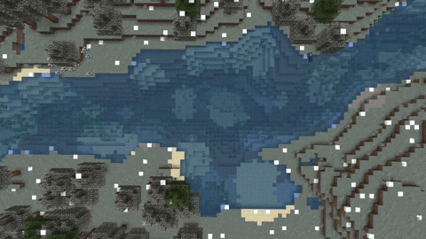

# 2022/8/8 维护内容

### 四季更新

#### 季节过渡

* 现在每个季节有五种独特的色调。一种（主要）颜色与之前相同，另外四种用于更加丝滑的过渡到另一个季节
* 色调变化会发生在每个季节进度的9%、18%、84%和92%处。经典色调用于18%-84%之间
* 在经典色调应用之前（季节总长度的18%之后）的季节特色变化是不同的

> 春季之后（初夏）的花朵不会立即完全移除
>
> 冬季之后（早春）的雪会非常缓慢的融化（不是大片同时融合）
>
> 初冬的水域结冰速度变慢并且从岸边向中心逐渐冻结
>
> 初冬视觉上下雪但不会在地面上生成雪
>
> 作物在初冬和冬末仍然可以（缓慢地）生长
>
> 作物在夏初和夏末也生长得更快，但不如仲夏快

#### 其他变化

春天树的默认颜色已更改为较深的粉红色

修复了插​​件在冬季因放置冰块而破坏农田的问题

核心升级至1.19.2
