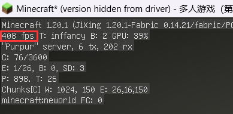
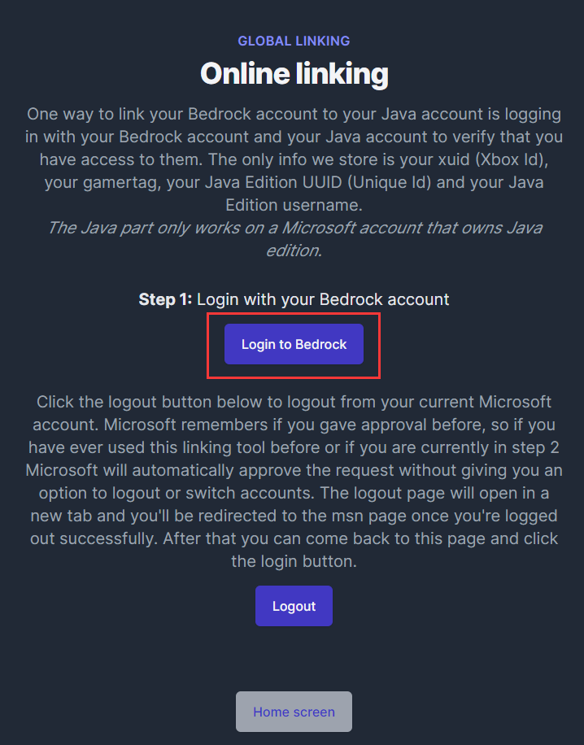
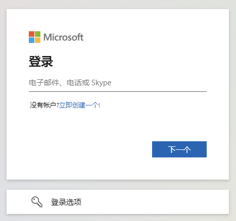
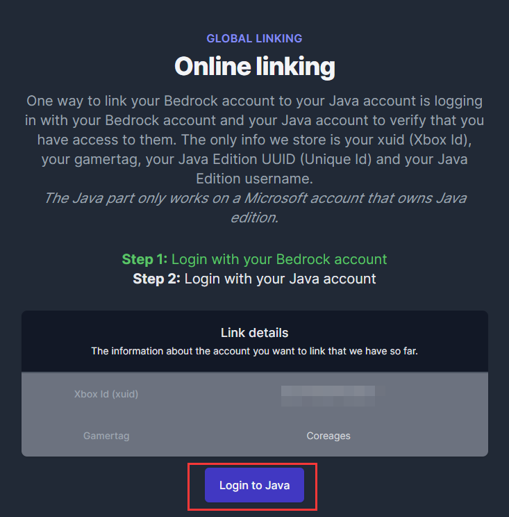

## 准备工作

正版Java账户 (可选), 正版基岩版账户, 基岩版客户端

## 连接至服务器

在基岩版客户端中添加服务器:

服务器地址: `be.coreages.com` 端口: `34655`

添加之后即可进入服务器, 游戏ID为基岩版正版ID

## 如何使用Java版正版ID在基岩版登录？
### 第一步：
访问 https://link.geysermc.org/method/online

### 第二步：
点击 `Login to Bedrock` 登录基岩版正版账户

### 第三步：
登陆成功后如图所示, 再点击 `Login to Java` 登录Java正版账户

### 第四步：
显示如下页面表示大功告成！现在使用基岩版登陆后ID为Java版正版ID

