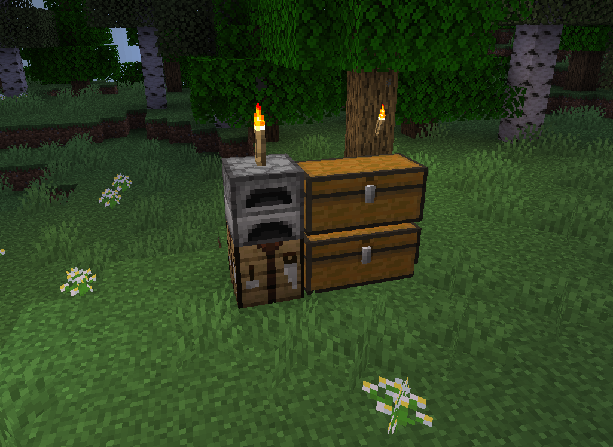

# 领地教程

### 1.建立领地

首先，准备好一个圈地工具，也就是木锄

然后前往你准备圈地的世界，不要在资源世界圈地，会不定时重造，领地都给你扬了。

作为教程，老狗建造了个前期临时据点作为要圈的领地。

然后高高举起你的圈地工具，用左键和右键选择立方体空间对角两个方块，如图所示，我分别用木锄左键和右键点击了蓝色羊毛和红色羊毛（为了更直观地展示放的羊毛，非必要）。如果没有问题，你会看到用粒子效果显示你选择的空间，如下图。

选好区之后，使用指令 `/res create 领地名` 领地名可以使用大小写字母、数字和下划线。

成功建立领地后，使用指令 `/res set 领地名` 可以打开权限设置菜单，进行一些设置。

如果你是江湖小虾，你的最大圈地范围是 32 × 32 可使用游戏币/点券升级权限组扩大范围，具体范围详情见下表。

更多指令和帮助请在游戏内使用指令 `/res help` 查看。

### 2.关于圈地大小和圈地费用


武林新贵和仗剑天涯、名扬四海可使用现金(游戏币)升级，后面三个需要花费点券购买。

圈地高度没有限制。


|   权限组    |     圈地大小      |   领地数量   |      圈地费用      |
|:--------:|:-------------:|:--------:|:--------------:|
|   江湖小虾   |    32 × 32    |   3 个    |       免费       |
|   武林新贵   |    64 × 64    |   4 个    |   0.05 / 方块    |
|   仗剑天涯   |   100 × 100   |   5 个    |   0.04 / 方块    |
|   名扬四海   |   128 × 128   |   7 个    |   0.035 / 方块   |
| **傲视群雄** | **160 × 160** | **10 个** | **0.03 / 方块**  |
| **举世无双** | **256 × 256** | **12 个** | **0.01 / 方块**  |
| **返璞归真** | **512 × 512** | **16 个** | **0.005 / 方块** |

### 3.领地常用指令

`/res create [领地名]` 创建领地

`/res list <玩家名>` 查询玩家拥有的(有权限)的领地

`/res tpset <领地名>` 将所在或指定领地的传送点设置为当前所站的位置

`/res set <领地名>` 打开所在或指定领地的权限设置菜单

`/res set <领地名> [权限] [true/false/remove]` (开启/关闭/重置)领地内的指定权限

`/res pset <领地名> [权限] [玩家] [true/false/remove]` (开启/关闭/重置)领地内指定玩家的指定个权限

`/res flags` 查看可设置的权限列表

特殊权限:

`admin` 拥有此权限的玩家可以获得领地权限管理权限, 单独给予某玩家这个权限

`trusted` 此权限包括领地的大部分常用权限, 对于信任的玩家设置这一个基本就够了

`/res info [领地名]` 查询所在领地或指定领地的信息

`/res message <领地名> [enter/leave/remove] [信息]` 设置所在或指定领地的进入/离开时显示的信息

`/res tp <领地名>` 传送至指定领地,快捷指令:`/cs <领地名>`

`/res remove <领地名>` 删除领地

`/res subzone <领地名> [子区域名]` 在领地中创建子区域

`/res expand <领地名> [扩展单位]` 向你面对的方向扩展领地

`/res rename [领地名字] [新名字]` 重命名领地

`/res show <领地名>` 显示某领地的边界

`/res give <领地名> [玩家]` 将你所在或指定领地赠与指定玩家

`/res reset <领地名>` 重置所在或指定领地的所有权限, 包括给其他玩家单独设置的权限
