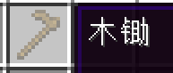

# 领地

### 如何建立一块领地

首先，准备好一个圈地工具，也就是木锄

然后前往你准备圈地的世界，不要在资源世界圈地，会不定时重造，领地都给你扬了。

作为教程，老狗建造了个前期临时据点作为要圈的领地。

然后高高举起你的圈地工具，用左键和右键选择立方体空间对角两个方块，如图所示，我分别用木锄左键和右键点击了蓝色羊毛和红色羊毛（为了更直观地展示放的羊毛，非必要）。如果没有问题，你会看到用粒子效果显示你选择的空间，如下图。

选好区之后，使用指令 `/res create 领地名` 领地名可以使用大小写字母、数字和下划线。

成功建立领地后，使用指令 `/res set 领地名` 可以打开权限设置菜单，进行一些设置。

如果你是江湖小虾，你的最大圈地范围是 32 × 32 可使用游戏币/点券升级权限组扩大范围，具体范围详情见下表。

更多指令和帮助请在游戏内使用指令 `/res help` 查看。

### 关于圈地大小和圈地费用


武林新贵和仗剑天涯可使用现金(游戏币)升级，后面三个需要花费点券购买。

圈地高度没有限制。


|    权限组   |      圈地大小     |   领地数量   |      圈地费用      |
| :------: | :-----------: | :------: | :------------: |
|   江湖小虾   |    32 × 32    |    3 个   |       免费       |
|   武林新贵   |    64 × 64    |    4 个   |    0.05 / 方块   |
|   仗剑天涯   |   100 × 100   |    5 个   |    0.04 / 方块   |
| **傲视群雄** | **160 × 160** |  **7 个** |  **0.03 / 方块** |
| **举世无双** | **240 × 240** | **10 个** |  **0.01 / 方块** |
| **返璞归真** | **400 × 400** | **15 个** | **0.005 / 方块** |
