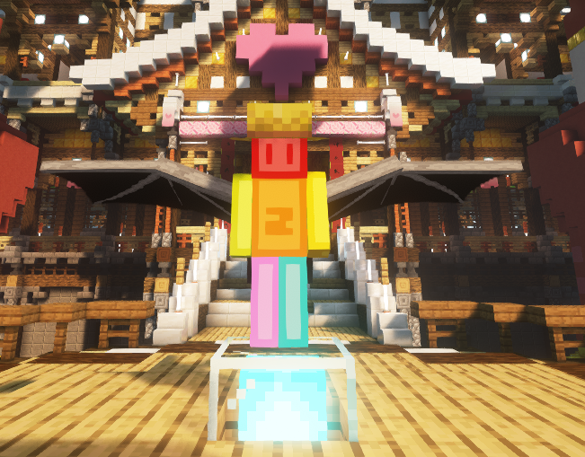

# 小提示

### 1、GPS网络的复杂度

复杂度基于发射器等级与发射器所在位置的高度(坐标中的Y)，计算公式如下
$$
等级倍数*高度+等级奖励
$$

|        等级         | 可存储 | 电力消耗 | 等级倍数 | 等级奖励 |
| :-----------------: | :----: | :------: | :------: | :------: |
|     GPS 发射器      |  16 J  |  2 J/t   |    1     |    0     |
|   高级 GPS 发射器   |  64 J  |  6 J/t   |    4     |   100    |
| 黑金刚石 GPS 发射器 | 256 J  |  22 J/t  |    16    |   500    |
|   充能 GPS 发射器   | 1024 J |  92 J/t  |    64    |   600    |

### 2、击杀掉落

击杀末影龙可以获得“龙翅膀” （拿在副手装备）

击杀村民可以获得“草帽” （戴在头盔栏）

