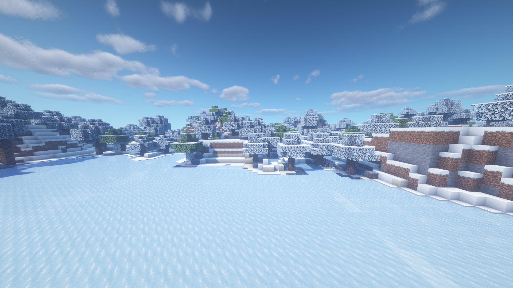

# 冬天

气温正在下降，生存正成为一个真正的挑战。大多数植物死于寒冷的雪中，幸存下来的植物无法生长。湖泊和河流结冰，游泳可能是致命的。水是深蓝色的，树木和草是浅灰色的。熬过漫长而寒冷的夜晚确实是一项挑战。

### 快速总结

* 冬季从12月4日开始
* 叶子和草有浅灰色调
* 天空更白了一点
* 水是深蓝色的
* 所有露天的水将会结冰
* 天气会下雪而不是下雨，雪季后会移除积雪
* 夜晚会很长，白天会很短
* 夜间天空会出现光点，有概率整晚都充满光点
* 狼、白狐、北极熊和雪人随处可见
* 会生成流髑而不是骷髅
* 露天的植物/作物将不会生长
* 平均温度在-10℃\~5℃，具体取决于生物群落

### 截图

