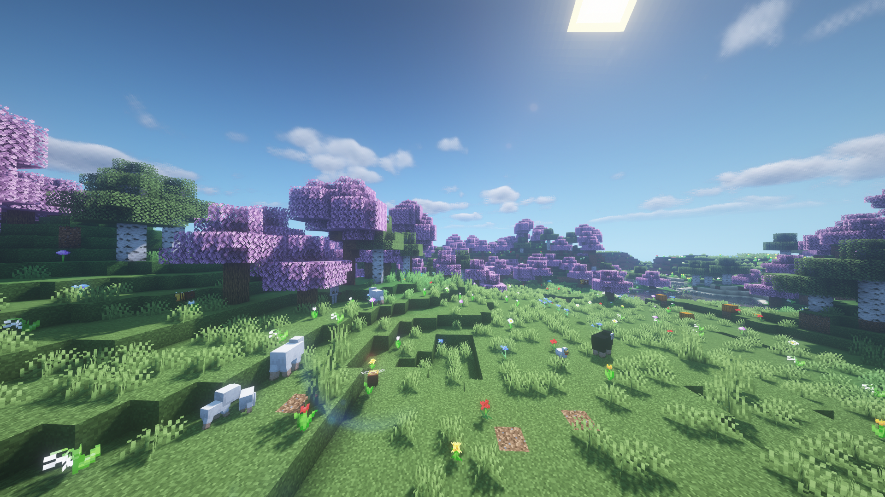

# 春天

春天是最为轻松的季节，它会给你的世界带来生机勃勃和温暖的感觉。树木呈现出美丽的色彩，水和天空呈现出温暖的色彩，整个世界将充满鲜花，每个角落都可以找到小动物。春天给你的世界一种特别的感觉，尤其是在漫长而寒冷的冬天之后。

### 快速总结

* 春季从3月4日开始
* 森林中的叶子会变成粉红色，谁会带有轻微的淡蓝色调
* 天空是淡蓝色的
* 到处都是鲜花，整个世界就像一片花海，并伴有一些落叶
* 冬季产生的冰雪将会融化
* 大量的羊、牛、猪、兔子和鸡会繁殖
* 蜜蜂的产卵率会增加
* 夜晚会出现萤火虫
* 白天和黑夜的长度大多是相等的
* 平均温度为5℃\~23℃，具体取决于生物群落

### 影响

春天的影响（就像所有季节一样）在每个生物群系中都不同。例如，丛林生物群系中的丛林树叶将保持其正常颜色。一些生物群落也没有任何花朵，只有一些颜色变化。每个生物群系的平均温度都不同，春天的沙漠显然会比冰冻的苔原温暖得多。

### 截图

