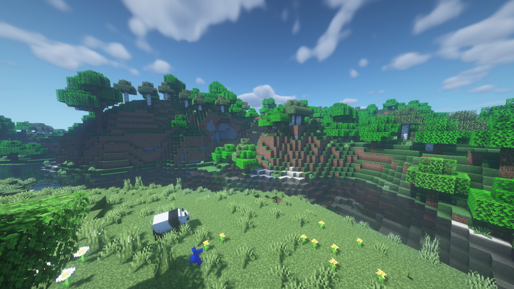

# 夏天

白天越来越长，太阳非常强烈。世界正在慢慢变成一个大丛林。通常只在丛林中出现的动物现在无处不在。树木有类似于丛林树叶的鲜艳绿色，天空和水变成浅蓝色。农作物的生长速度也非常快，气温也在飙升。确保随身携带一些额外的水来克服热量。

### 快速总结

* 夏季从6月4日开始
* 大多数生物群落中的数目和草都具有类似于丛林树叶的鲜绿色
* 寒冷的生物群落具有平原的草色
* 炎热的生物群落看起来有点干燥
* 水和天空的颜色是浅蓝色
* 夜晚会出现萤火虫
* 到处都是浆果丛
* 降水会减少
* 夜空中小概率会出现流星
* 通常在丛林中生成的动物现在可以在任何地方生成
* 作物/植物会以2倍的速度生长
* 会生成尸壳而不是僵尸
* 白天会很长，夜晚会很短
* 平均温度为25℃\~40℃，具体取决于生物群落

### 截图

