这里是粘液科技的入门教程

直接进入正题

游戏内可以通过`/sf guide`或简化为`/sg`来获取粘液科技指南书，这本书包含了粘液科技的各种物品与制作方法，均有详细介绍

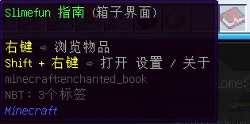

(背包里的粘液指南书)

___附:如果未装服务器推荐材质包,那么粘液指南书会是原版的附魔书(如下图)___

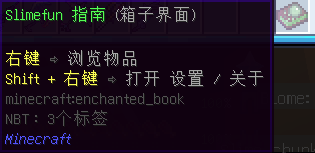

___(装了服务器材质包之后的粘液指南书)___

___后续内容均用原版材质,请注意甄别___

右键可以打开粘液指南书

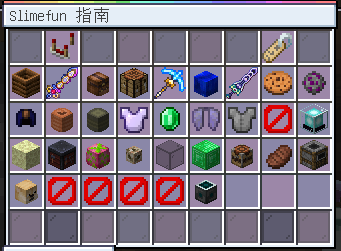

(打开的粘液指南书页面)

打开后的指南书默认是首页,也就是内容分类页,可以指向对应分类查看

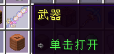

(武器分类)

粘液科技的物品有特殊的制作方式,而不是使用普通的原版工作台,所以我们先认识一下基本制作机器:强化工作台（位于基础机器,不同版本翻译可能不同,但不会影响使用）

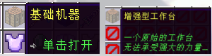

(强化工作台的分类位置)

点击强化工作台,可以查看该物品的合成方法与配方
中间为物品配方,左边为制作方式

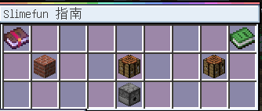

(强化工作台的制作方法)

指针查看左边的石砖,可以看到石砖显示的制作方式是:__多方块结构__

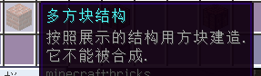

__这里插入一下新的知识点:多方块结构__

多方块结构在原版游戏中也存在,即制作铁傀儡、雪傀儡与凋零的方式
看到这里,你可能已经懂了
多方块结构指的是将对应方块以配方所示的方法放置在地上以达成一个结构机器

如强化工作台,配方显示的是`工作台`与`发射器`
我们将对应的机器摆放在地上,如果摆放正确,那么将视为一个`强化工作台`结构

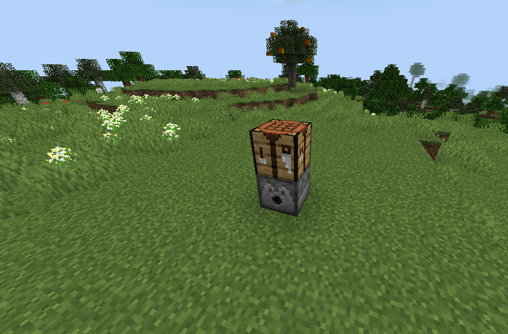

（摆放完成的强化工作台）

那么强化工作台该如何使用呢?

这里我们使用武器分类里的物品:`爷爷的拐杖`作为演示

打开指南书,点击武器,可以看到,该物品需要一定的经验值才能解锁,包括后续的其他物品也一样,均需要对应的经验值解锁,解锁后扣除对应等级 
__~~粘液作者的恶趣味~~__

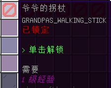

(爷爷的拐杖消耗1级解锁)

__附:如果不想等待解锁的进度可以shift+右键粘液指南进行设置,解锁物品时部分相关物品会连携解锁,后续探索中可以自行留意__

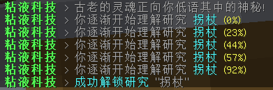

__(解锁的进度过程)__

解锁后再次点击可以查看该物品的制作配方

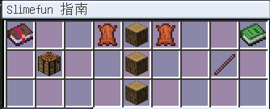

(合成配方)

合成的方法是:

将物品放入发射器内,按配方显示的位置进行摆放

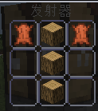

(发射器摆放配方的界面)

随后,右键工作台进行一次合成

如果配方摆放错误/无物品

则会提示无法合成

(上为摆放错误的提示,下为无物品提示)

成功合成后,会有按钮放置的提示音

并且聊天栏不会出现错误提示

打开发射器即可查看合成完成的物品

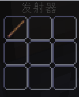

(爷爷的拐杖合成成功,附带击退V)

你已经学会了基础的合成方法,快去探索更多粘液科技物品吧,或者接着前往下一个教程——>[传送门](slimefun/1.2.md)

小提示:
* *如果你确定没有摆放错误却无法合成某样物品,可以看一眼配方左边的合成方式,并不是所有物品都是通过强化工作台/多方块结构合成的*
* *粘液科技的游玩流程较长,需要耐心进行,即便到了后期可以全自动生产后拥有资源,也会有需要手动搓机器的过程,这是每个玩家的必经之路*
* *经验不够解锁物品?刷经验太慢了?可以试试/bs打开菜单右键点击左下的花,前往温泉挂机获取经验,或者询问其他玩家是否有公共刷怪笼可以使用*
* *想要与更多玩家进行~~病情~~交流?可以加入QQ群:<a href="http://qm.qq.com/cgi-bin/qm/qr?_wv=1027&k=Jg8m2DpVKarkWNR-F_2qsHTZWAxpIr1F&authKey=gpewqg7FWMxJQNxCTrZQeiK1D69tZhlgFC1x35N96fQ%2FF8VCq3fdf93sPBq8TxiL&noverify=0&group_code=902294518" title="点我进群">902294518</a>*