# **入门基础与多方块结构**

这里是粘液科技的入门教程，此教程由`_Ix_Love-玖`编辑

学习过程中如有疑问，请QQ群内咨询 [902294518](https://qm.qq.com/q/t0CAd0mWf6)

### 一、粘液科技指南书

游戏内可以通过`/sf guide`或简化为`/sg`来获取粘液科技指南书

这本书包含了粘液科技的各种物品与制作方法，均有详细介绍 

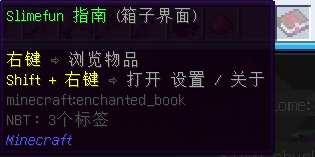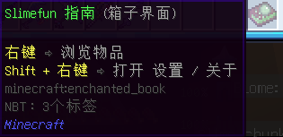

**后续内容均用原版材质,请注意甄别** 

将书拿在手上并右键 可以打开粘液科技指南书 

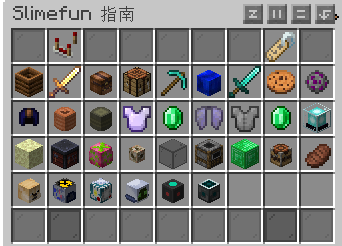

打开后的指南书默认是首页，也就是内容分类页，可以指向对应分类查看 

------

粘液科技的物品有特殊的制作方式，而不是使用普通的原版工作台 

所以我们先认识一下最基本制作机器 

**增强型工作台**：位于基础机器分类内，不同版本翻译可能不同，但不会影响使用 

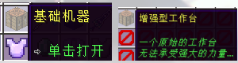

点击增强型工作台，可以查看该物品的合成方法与配方 
中间为物品配方，左边为制作方式 

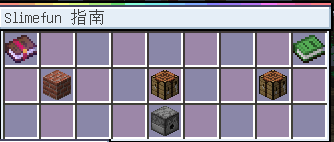

指针查看左边的红砖，可以看到显示的制作方式是：**多方块结构 **

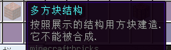

我们该如何按照配方制作出来？

下面开始引入一个新概念：**多方块结构** 

### 二、多方块结构

多方块结构在原版游戏中也存在，即制作铁傀儡、雪傀儡与凋零的方式 都属于是多方块结构
看到这里，你可能已经懂了 

多方块结构指的是将对应方块以配方所示的方法放置在地上以达成一个结构机器 

------

我们以增强型工作台为例，配方显示的是`工作台`与`发射器` 
我们将对应的机器摆放在地上，如果摆放正确，那么将视为一个`增效型工作台`结构 

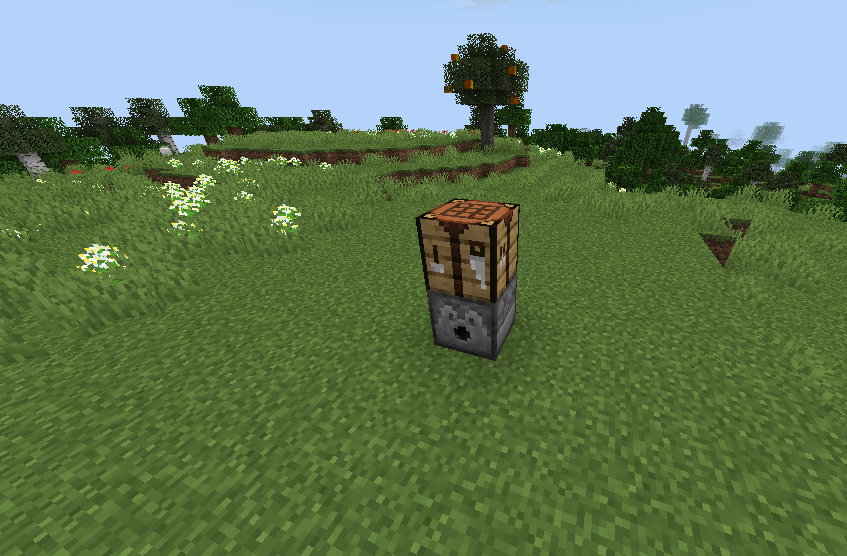

那么强化工作台该如何使用呢?

这里我们使用武器分类里的物品：`爷爷的拐杖`作为演示 

打开粘液科技指南书，点击武器，可以看到，该物品需要一定的经验值才能解锁 

包括后续的其他物品也一样，均需要对应的经验值解锁，解锁经验值为你的游戏等级  
__~~粘液作者的恶趣味~~__

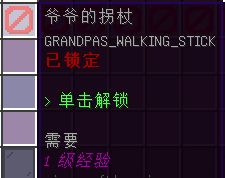

> 如果不想等待解锁的进度可以shift+右键粘液指南进行设置,解锁物品时部分相关物品会连携解锁,后续探索中可以自行留意 

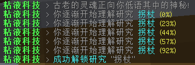

解锁后再次点击可以查看该物品的制作配方 

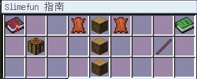

合成的方法是:

将物品放入发射器内，按配方显示的位置进行摆放 

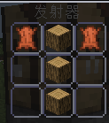

随后，右键工作台进行一次合成 

如果配方摆放错误/无物品，则会提示无法合成 

成功合成后,会有按钮放置的提示音，并且聊天栏不会出现错误提示，打开发射器即可查看合成完成的物品 

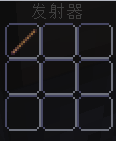

> 所有的基础机器配方都是放进发射器，但是右键点击合成的方块不一定是工作台，可能是栅栏、炼药锅、铁砧等 (放完配方对着机器一通乱点总能点到)

粘液科技中文wiki-基础机器：[点我跳转](https://slimefun-wiki.guizhanss.cn/Basic-Machines)

------

你已经学会了基础的合成方法，快去探索更多粘液科技物品吧！

或前往下一个教程👉[传送门](../slimefun/1.2.md)

------

小提示:
* 如果你确定没有摆放错误却无法合成某样物品,可以看一眼配方左边的合成方式,并不是所有物品都是通过强化工作台/多方块结构合成的
* 粘液科技的游玩流程较长,需要耐心进行,即便到了后期可以全自动生产后拥有资源,也会有需要手动搓机器的过程,这是每个玩家的必经之路*
* 经验不够解锁物品?刷经验太慢了?可以试试/bs打开菜单右键点击左下的花,前往温泉挂机获取经验,或者询问其他玩家是否有公共刷怪笼可以使用
* 想要与更多玩家进行~~病情~~交流?可以加入QQ群：[902294518](https://qm.qq.com/q/rFwmLujMqc)
