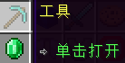
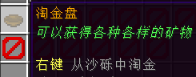
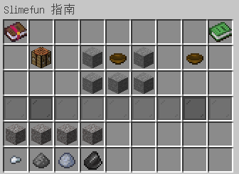
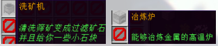
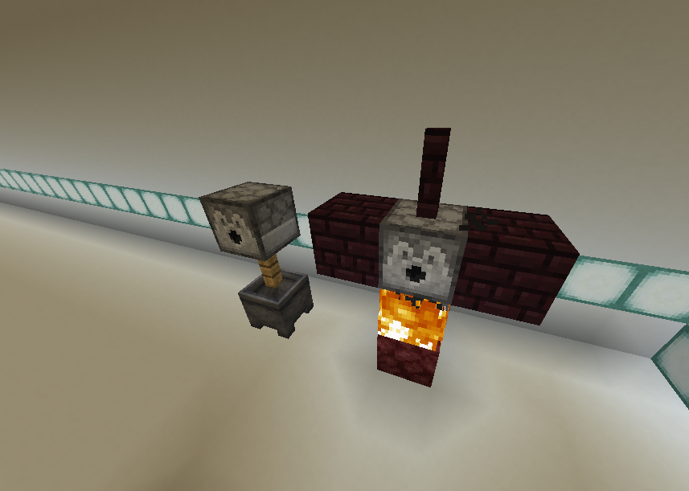
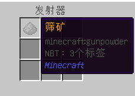
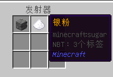
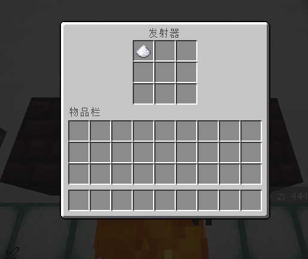
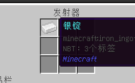

# **矿粉与矿锭的获取**

这里是粘液科技的教程的矿粉与矿锭的获取，此教程由 `_Ix_Love-玖` 编辑

在这里，我们将学习其他基础机器的使用方式与核心的材料获取

学习过程中如有疑问，请QQ群内咨询 [902294518](https://qm.qq.com/q/t0CAd0mWf6)

------

首先依然是打开粘液科技指南

选中 __工具__ 分类，解锁第一个物品 __淘金盘__

作为初期获取矿粉的唯一来源，淘金盘可以通过***右键***点击沙砾来淘取沙砾中的物品，可获得的物品可以在淘金盘的配方下方查看

我们要使用淘金盘来获取筛矿(火药材质)

这个材料可以进一步加工从而获取9种矿粉的随机一种

同时也是中期核电的能源：**铀**的制作材料

------

这里我们先学习如何加工筛矿

返回指南的界面，打开**基础机器**分类，解锁机器：**洗矿机**和**冶炼炉**

> 冶炼炉相邻机器为简易冶炼炉，可供前期将矿粉烧成锭 ，但无法加工其他材料 ，所以还是推荐直接使用冶炼炉，两者制作方式并无太大难度

打开配方可以看到，这两个机器都属于多方块结构，接下来我们直接动手搭建

> 冶炼炉在使用过程需要保持底下有火焰，并且使用一定次数后会消耗掉火焰(熄灭)，需要重新点火，在前期可以通过搭建一个侦测器与发射器来自动检测火焰的熄灭，后期可以替换为自动点火机

接下来，我们打开淘洗机的发射器界面，将获取的筛矿放入

随后，**右键**点击淘洗机的**橡木栅栏**即可进行一次淘洗，点击淘洗时会有水的粒子效果与音效

淘洗完成后 ，打开发射器可以看到 ，筛矿已经被洗成**矿粉**与**副产物(石块)**

> 石块在现阶段暂时无用 ，但在中后期网络阶段是基础的合成材料之一

淘洗机一共可以随机洗出9种矿粉 ，每次获取其中一种 ，9种矿粉分别为:**铝粉、铜粉、铁粉、金粉、锡粉、锌粉、银粉、铅粉与镁粉**

获取的矿粉可以通过冶炼炉进行冶炼 ，从而加工为对应的矿锭 **(需要先解锁对应的矿锭 ，此处仅做冶炼的教程 ，后续合成配方需使用时可以按该方法获取矿锭)**

打开冶炼炉 ，放入刚才洗出来的矿粉

同样的方法 ，右键点击冶炼炉上方的下界砖栅栏进行一次加工

随后打开冶炼炉 ，即可获取你所加工的矿锭

矿锭的获取教程到这里就结束了 ，在这里我们还了解到 ，基础机器的使用方法都类似 ，拥有一个 **操作界面(发射器)** 与 **使用开关**
一般应为对应结构的栅栏部分，后续其他机器如压力机等会使用不一样的开关

比如坩埚 (压力机结构之一)

------

你已经学会了基础的合成方法，快去探索更多粘液科技物品吧！

或前往下一个教程👉[传送门](../slimefun/1.3.md)

什么？没学懂？回去复习一遍👉[时光机](../slimefun/1.1.md)

------

小知识:
* 基础机器中有各种机器都有对应的用途 ，挨个解锁并搭建起你的粘液科技工作室吧
* 嫌冶炼炉点火太麻烦?前期我们可以利用侦测器与发射器组合为一个自动检测火焰的机器 ，但还有更方便的方法 ，解锁基础机器里的 __自动点火器__ 对准冶炼炉 ，放入打火石即可自动续杯 ，但首次使用依然要手动点一次火
* 基础机器中的 __自动淘金机__ 可以省去你带着淘金盘一块冒险从而被筛矿等物品光速堆满背包的过程 ，你只需要在搭建完成的机器面前拿着大堆沙砾右键其活板门即可复现物品喷泉
* 部分机器使用时并不是即时加工完成 ，而是会有一个几秒的过程，如**压力机**、**魔法工作台**等等
* 杂鱼\~杂鱼\~杂鱼玩家不敢来QQ群：[902294518](https://qm.qq.com/q/rFwmLujMqc)
