# 核反应堆的搭建

这里是粘液科技的教程的核反应堆搭建教程，此教程由 `GardeniaBlow-紫薯` 编辑

在这里，我们将学习核反应堆的搭建，以及建设他的配套设施

------

核反应堆是一种快速且高效的发电机，并需要配备制冷系统

请务必按照步骤一步步操作，负责很容易导致反应堆爆炸

开始本章之前 请确保您已学会了[能源系统与货运系统](../slimefun/1.3.md)的内容

------

[TOC]

### 一、搭建核反应堆

#### 1.准备阶段

请准备以下好物品

|  所属分类  |      物品      | 数量 |
| :--------: | :------------: | ---- |
| 能源与电力 |    核反应堆    | 1个  |
|  货物管理  | 反应堆访问接口 | 1个  |

#### 2.搭建反应堆

核反应堆需要被水包围

所以你可以像下图一样搭建一个5x5x5的框架，然后中间3x3x3的区域放水

~~当然 你要是不想搭框架也可以直接把他放在至少为3x3x3范围的水里~~

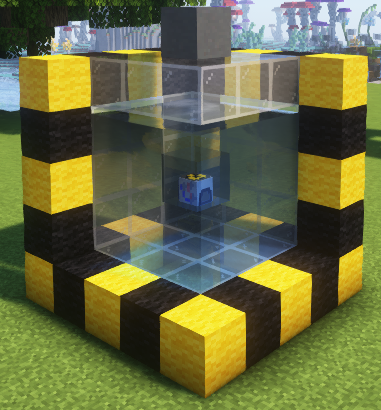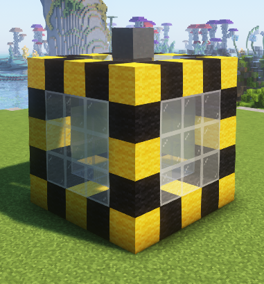

可以看到，反应堆在水池中心，反应堆访问接口在上方第三格的位置

### 二、使用核反应堆

打开反应堆访问接口可以看到三个区域

从左到右依次是，燃料槽、副产品槽、冷却剂

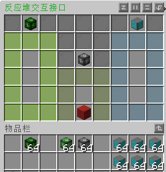

现在让我们开始制作反应堆冷却剂产线 

~~(当然，你想自己手搓燃料并自己手动添加也不是不可以)~~

> [!WARNING]
>
> 在启动反应堆之前我们必须要装填的物品是冷却剂，否则你的反应堆将会爆炸

#### 1.准备阶段

请准备以下好物品

|  所属分类  |      物品       | 数量 |
| :--------: | :-------------: | ---- |
| 能源与电力 |      冰箱       | 3个  |
| 能源与电力 |     流体泵      | 1个  |
|  货物管理  | 货运节点 (输入) | 7个  |
|  货物管理  | 货运节点 (输出) | 7个  |
|  货物管理  | 货运节点 (连接) | 6个  |

注：本教程中的货运系统用的信道ID为 1-8 (8条信道)

#### 2.搭建反应堆冷却剂产线

详情请看下方两张图片，如还有疑问请[群内](https://qm.qq.com/q/SO2yixrLOM)咨询

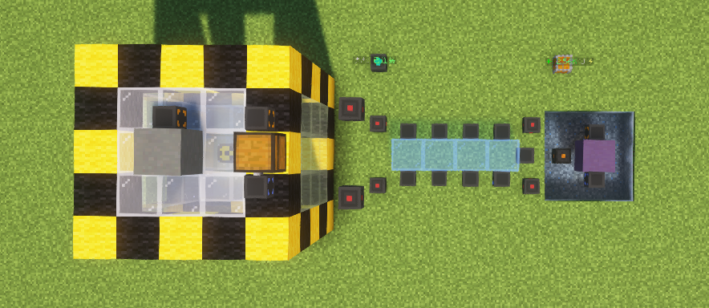

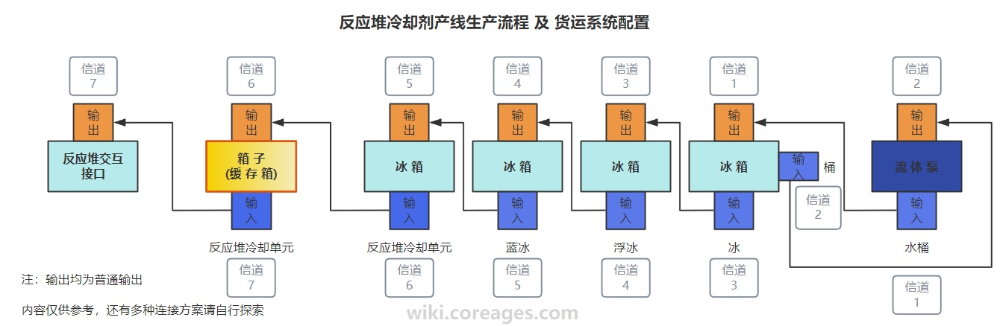

------

产线装配完成后冷却剂会自动进入到交互接口

注：一个冷却剂的消耗时间大概是：25s

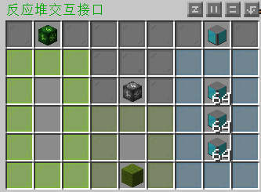

#### 3.添加燃料 启动核电

> ###### 保险起见 请先自行在 核反应堆 内添加3组冷却剂
>
> 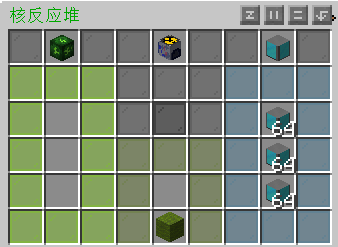

开始添加燃料之前请为自己准备一套 **防护服** (所属分类：防具)

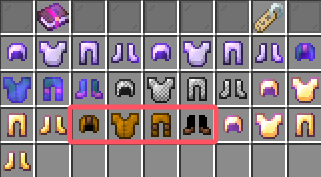

核反应堆的燃料有

|         燃料         | 燃烧时间 |
| :------------------: | :------: |
| 钚铀混合氧化物核燃料 |  25分钟  |
|          铀          |  20分钟  |
|          镎          |  10分钟  |

钚铀混合氧化物核燃料燃烧完产生铀，铀燃烧完之产生镎以此类推就是

`钚铀混合氧化物核燃料 → 铀 → 镎 → 钚`

然而通过查看他们的配方发现，**铀**才是我们的最优选择

那么就让我们先手搓一点铀吧！[(铀产线点此跳转)](#铀产线)

------

现在你只需往反应堆交互接口的燃料槽加入铀，然后将核反应堆接入能源系统，核反应堆即启动成功！

启动前后 请务必检查反应堆冷却剂是否正常供应

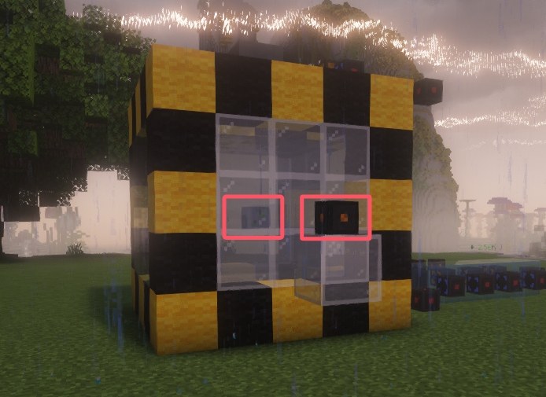

#### 4.发电模式切换

核反应堆有两种发电模式

发电：能源系统内没有机器需要电，他就停止发电

生产：一直发电

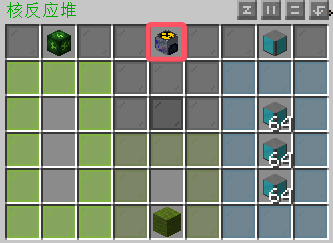

### 关于副产品的补充说明

为防止副产品滞留在反应堆，可以在前面的基础上再接入下图这套配置

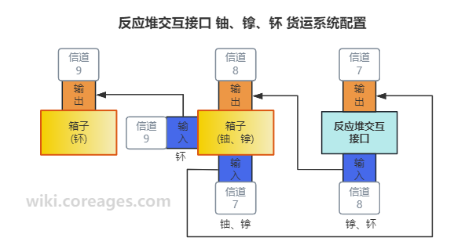

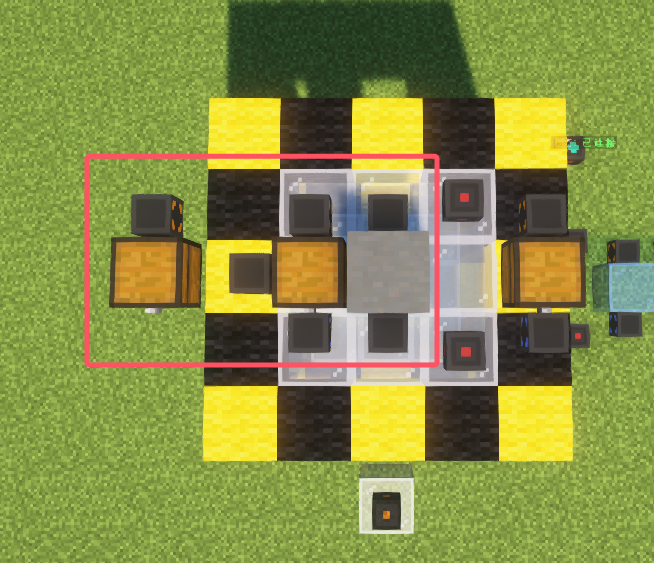

------

恭喜你！进入核电时代！ 到这里你的粘液科技水平已经是毕业了！

------

### 铀产线

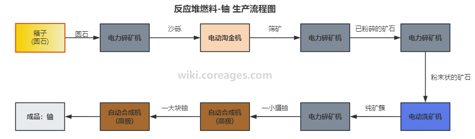
