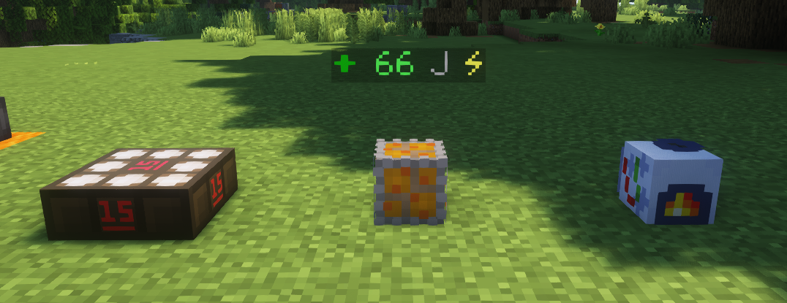

# **能源与电力（能源网络）**

这里是粘液科技教程的能源与电力篇，此教程由 `GardeniaBlow-紫薯` 编辑

在这里，我们将学习**能源网络**的构成及其**电力机器**的使用

学习过程中如有疑问，请QQ群内咨询 [902294518](https://qm.qq.com/q/t0CAd0mWf6)

------

在粘液科技书目录的**能源与电力**中包含各种电力机器以及存储、传输电力的装置。

所有设备使用焦耳（**J**）作为能源/电力单位。

正是这些机器的出现 为我们的游戏带来的各种便利 以及自动化生产

------

## 一、能源网络的构成

能源网络主要由能源核心、发电机、储能电容(可选)组成

下面将讲解能源调节器、能源连接器、发电机、储能电容的使用

### 1.能源核心

能源调节器是能源网络的核心，它可以显示当时网络内的能量状态，有了它，能量才能进行传输。

能源调节器的传输距离为7格

且只能往**上、下、左、右、前、后六个直线方向**传输能量

> 因为上、下方向不太方便教程进行演示，所以后续教程均以前、后、左、右四个方向进行示例演示

你的能源连接器、发电机、机器、电容必须在**能源调节器**的**7格直线范围**之内

即使中间有方块阻挡也可以连接

每个能源网络内只能有1个能源调节器，如果有多个，也只有1个能源调节器起作用

由于每个能源网络只能有 1 个能源调节器，如果想要扩展能源网络的范围，你就需要用到能源连接器

### 2.能源连接器

**注意**：粘液书上写的范围的6格，但是经过实际测量，实际传输范围是7格

~~（估计是作者忘记改文字说明了？）（记得以前玩一直都是6格，偷偷暗改是吧byd）~~

同能源调节器一样，只能往**上、下、左、右、前、后六个直线方向**传输能量

发电机、电容、机器也一样必须在这个范围内

通过右键能源连接器，该节点的连接状态将会发送至聊天栏

### 3.发电机和储能电容

#### ①发电机

粘液科技科技本体的发电机有

**太阳能**发电机、**煤**发电机、**生物**发电机、**镁**发电机、**岩浆**发电机、**燃烧反应机**、[反应堆](1.4.md)、

详情请前往能源与电力目录查看

下面将以太阳能发电机和煤发电机作为示例进行讲解

------

可以看到上面有发电机的信息(煤发电机)

64 J 可储存 ：意思是可以储存64J能源

16 J/s ： 意思就是发电的功率为每秒16焦

- **太阳能发电机**

  顾名思义，太阳能发电机肯定使用太阳能发电

  太阳能发电机不需要任何燃料，只需要上方没有任何方块阻挡阳光 (光照等级必须满足15)

  太阳能发电机无法在夜间产生电力，除非你拥有充能太阳能发电机

- **煤发发电机**

  尽管叫做煤发电机，但也可以使用烈焰棒、所有木制物品作为燃料

  打开粘液书在该机器的合成页面下方会显示该机器所能用的物品

  

  发电机必须在任意能源调节器、能源连接器或电容的距离范围内，且提供可用的燃料后才能工作

  

  更多发电机的使用以及粘液科技附属还有更多好用的发电机，请您自行探索

#### ②储能电容

​	电容可以在能源网络中存储能量

​	不同的电容存储能量的大小也不一样，见下表

|         电容         |   容量   |
| :------------------: | :------: |
|     小型储能电容     |  128 J   |
|     中型储能电容     |  512 J   |
|     大型储能电容     |  1024 J  |
|     巨型储能电容     |  8192 J  |
| 黑金刚石镶边储能电容 | 65536 J  |
|     终极储能电容     | 524288 J |

​	电容的材质会根据其存储的能量而变化。你可以使用**万用表**（所属分类：科技工具）来查看准确的数值。

## 二、电力机器

~~电力机器，顾名思义就是需要电力的机器~~

这些机器能代替手工，并为我们实现自动化生产

下面将选取电力碎矿机和作为生长加速器作为讲解示例

将鼠标停留在上面，可以看到上面标明了机器的一些基本信息：速度、功耗、范围、可储存的能量值、需要的物品

我们点击进入机器(电力碎矿机) 的配方界面，下方的物品就是该机器能够处理/生产的物品

## 三、小提示

- 一台发电机可以接入多个能源网络 前提是你的能源网络不能互相冲突

- 储能电容也可以在能源网络中充当能源连接器，传输距离范围一样是7格
- 只有部分机器可以储存能源（具体看机器上面的介绍）。但它们不像电容，如果储存的电能在达到峰值前没有被使用，它就会被立即重置。
