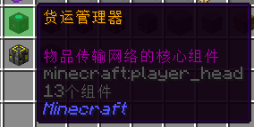

# **货运管理（货运系统）**

这里是粘液科技教程的货运系统篇，此教程由 `GardeniaBlow-紫薯` 编辑

在这里，我们将学习货运系统

------

货运系统可以自动在容器及机器之间运输物品

正是货运系统的出现 为我们的游戏带来的各种便利 以及自动化生产

------

## 一、货运系统的构成

货运系统主要由货运核心、货运节点组成

### 1.货运核心

货运管理器是货运系统的核心。~~他的作用就是没他不行~~

正在快马加鞭赶工中.....
