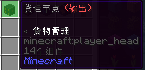

# **货运管理（货运系统）**

这里是粘液科技教程的货运系统篇，此教程由 `GardeniaBlow-紫薯` 编辑

在这里，我们将学习货运系统 

学习过程中如有疑问，请QQ群内咨询 [902294518](https://qm.qq.com/q/t0CAd0mWf6)

------

货运系统可以自动在容器及机器之间运输物品

正是货运系统的出现 为我们的游戏带来的各种便利，比如自动化生产线

------

**货运系统主要由货运核心、货运节点组成**

### 一、货运核心

货运管理器是货运系统的核心，每个货运网络必须且只能有一个货运管理器 ~~他的作用就是没他不行~~


连接成功的货运节点上方会有蓝色粒子

(右键货运管理器可以开关粒子效果)


### 二、货运节点

货运节点分为：连接器、输入、输出

#### 1、连接器


连接器的作用是扩充货运网络范围，将货运网络中的不同部分连接起来

连接器的传输范围为**上、下、左、右、前、后 直线方向 6 格**，在此范围内的输入、输出节点都将连接到网络中，且上方会有蓝色粒子


下图是一个示例，图中圈出来的位置都是连接器

(为方便观看，关闭了粒子效果)


#### 2、输入 输出



**输入节点**：过滤并将物品传输到匹配输出节点

**输出节点**：提取对应输入节点信道中的物品。如需过滤物品，请用**高级货运节点（输出）**

输入、输出节点必须放置在容器或机器上（Shift+右键放置）


右键输入节点可以看到以下界面：

注：**高级货运节点（输出）**的配置界面 和 下图一样


- [左边的] **3 x 3 格子** 

  将容器/机器中的物品送入货运网络时，放在这里的物品将被包括/排除。

  ------

- [上面的白色羊毛] **模式：白名单/黑名单** 

  控制3 x 3 格子中的物品是被列入白名单（被包括）还是黑名单（被排除）中。

  ------

- [书与笔] **“智能填充”模式** 

  打开后，货运节点会尝试让货运网络中的物品保持在一定数量，但这个功能并不完美，仍会尝试填满在一堆物品前的空位

  ------

- [能源调节器] **轮循模式** - 如果启用，物品将在信道中平均分配。

  ------

- [空地图] **匹配在物品名称下的文字** 

  如果启用，只有物品名称下有相同文字的物品才会被列入白名单/黑名单中。

  ------

- [下面的白色羊毛] **信道**

  物品传输使用的信道。最多 16 个信道，每个信道以不同颜色的羊毛标记

  输入、输出靠匹配信道实现输送物品

  例：信道为1的输入，只能运到信道为1的输出

  ------

- [下面的白色羊毛左/右的箭头] **上/下一信道**

  切换信道
  
  ------
  
  

### 注意

服务器每个区块货运节点上限为：**96个**

------

**什么？96个！ 我的工业帝国梦那不没了吗？**

不用担心，服务器添加了附属插件


**网络 (Networks)** - 一个简单易用且功能强大的物品存储系统

后续会更新该附属的教程

不过该附属的运输原理跟此篇教程有相似之处，感兴趣的玩家可以先自行探索

```
连接器 对应 网桥

输入节点 对应 网络抓取器

输出节点 对应 网络推送器

货运管理器 对应 网络控制器
```

