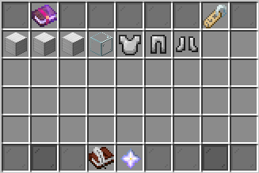
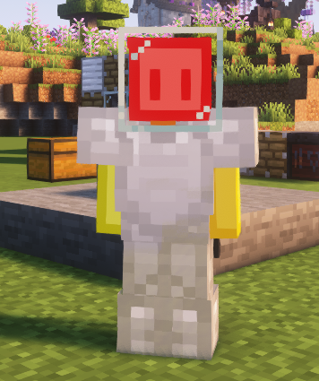
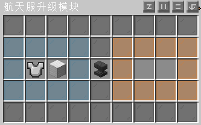

# 装备

装备分为**宇航服**和**升级模块**

所属目录：星系→设备

### 一、宇航服

宇航服是太空的必需品 ~~（当然你想要穿匠魂装备加回血buff硬抗也不是不行）~~

宇航服包括：宇航服头盔、宇航服胸甲、宇航服护腿、宇航服靴子

**宇航服头盔**需要拿在手上右键才能佩戴

**宇航服胸甲**需要放到**氧气填充器**中填充氧气

### 二、升级模块

各个星球的环境不一样，所以要求宇航服也要有不同的升级模块来适应不同的环境 

~~（当然还是那句话，你想要穿匠魂装备加回血buff硬抗也不是不行）~~

升级模块包括：耐热性、抗寒性、抗辐射三种升级模块

将**宇航服**和**升级模块**放入到**机器：航天服升级模块**中即可完成装配

【头盔和胸甲可以装 3个模块，护腿和鞋子最多可以装 2 个模块】

各星球的环境及所需的模块见下表

|     星球      |  环境(所需模块)  |
| :-----------: | :--------------: |
|     月球      |     1级抗寒      |
|     火星      |     2级抗寒      |
|     金星      |     10级耐热     |
| 木卫一 - 艾奥 | 5级耐热、3级辐射 |
|    木卫二     |     3级抗寒      |
|    土卫二     |     3级抗寒      |
| 土卫六 - 泰坦 |     6级抗寒      |
