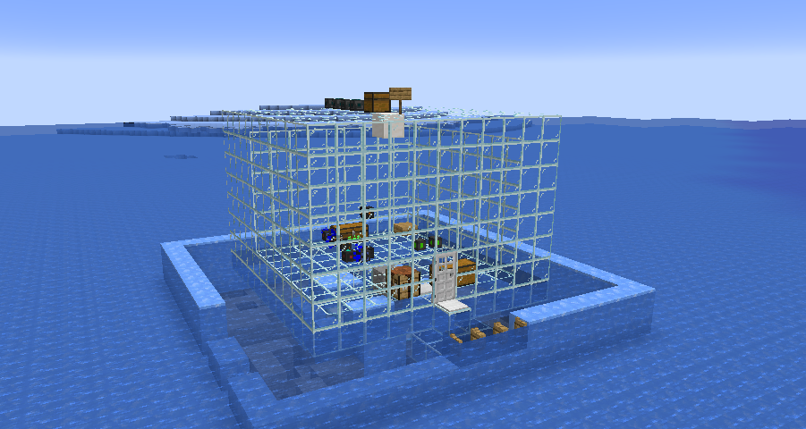

# 密封环境

以下机器只能在密封区域内才能正常工作

- 空间加热器
- 空间冷却器
- 离子分散器
- 氧气散播机

密封的算法（[洪水填充](https://en.wikipedia.org/wiki/Flood_fill?useskin=vector#)）从需要密封的方块开始，检查直接相邻的方块。如果方块是可密封的，算法停止。如果不可密封或是空气，算法会继续检查该方块。不可密封的方块，即使是实体方块，也被视为空气

**讲白了就是使用下面"可以作为密封环境的方块"所搭建的完全封闭的区域**

### 可以作为密封环境的方块有

- 陶瓦（所有颜色，不包括带釉的）
- 基岩
- 屏障
- 末地门框架
- 结构方块
- 命令方块
- 玻璃（所有颜色，不包括玻璃板）
- 混凝土（所有颜色）
- 黑曜石
- 铁块
- 金块
- 钻石块
- 下界合金块
- 铁门
- 铁活板门
- 涂蜡的铜块（任何氧化状态）
- 海晶灯
- 石英块
- 平滑石英块

不属于”可以作为密封环境的方块“ 即使是实体方块，也被视为空气

