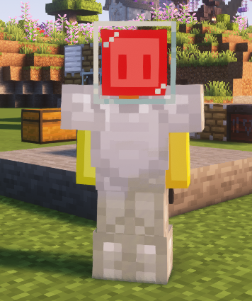

# 发射火箭，前往太空

下面我们将以前往月球为教程演示

### 一、发射前的准备 - 宇航服

请准备好一套[宇航服](slimefun/Galacifun/2.md) ~~（当然你想要穿匠魂装备加回血buff硬抗也不是不行）~~

**宇航服胸甲**需要放在**氧气填充器**内填充氧气

因为[月球](slimefun/Galacifun/celestialboby/2.md)**的环境为**1级抗寒 (不同星球的环境不一样，所以所需的模块和等级也不一样，具体请看星球环境)

所以我们需要制作[1个抗寒性升级模块](slimefun/Galacifun/2.md)，并用到机器"[航天服升级模块](slimefun/Galacifun/machine/2 .md)"，将模块装备到宇航服上(任意一件即可)

### 二、发射前的准备 - 火箭/燃料

刚踏入星际科技，我们只能制作**一阶化工火箭**，其他火箭都需要太空维度的材料才能合成

除火箭外，你还需要**1个发射台核心**和**8个发射台地板**用来构建火箭发射台

你还需要准备好燃料，因为刚踏入星际科技，所以你只能使用**原油桶**或者**燃料桶**

### 三、发射火箭

如下图所示，将你的**发射台核心**用**发射台地板**包围起来

随后将**火箭**放置在**发射台核心**上

为防止出现BUG导致火箭坏掉变成头颅

建议先把发射台核心替换成普通方块，再放置火箭，最后将普通方块替换成发射台核心

------

右键**发射台核心**即可打开火箭交互页面

**左边**放你要随火箭携带的物品，**右边**放火箭的燃料

我们前往月球只需要放1个燃料就行了，越远的星球要的燃料越多

------

下面开始 **发射火箭，进入太空**

1.右键火箭 选择你要前往的地方 （这里我们选择“月球”）

2.然后在聊天栏左下角输入坐标（例如200 200） ，等待片刻

3.到达之后，你脚下会生成一个箱子，你的火箭、多余的燃料、携带的物品都会在里面
