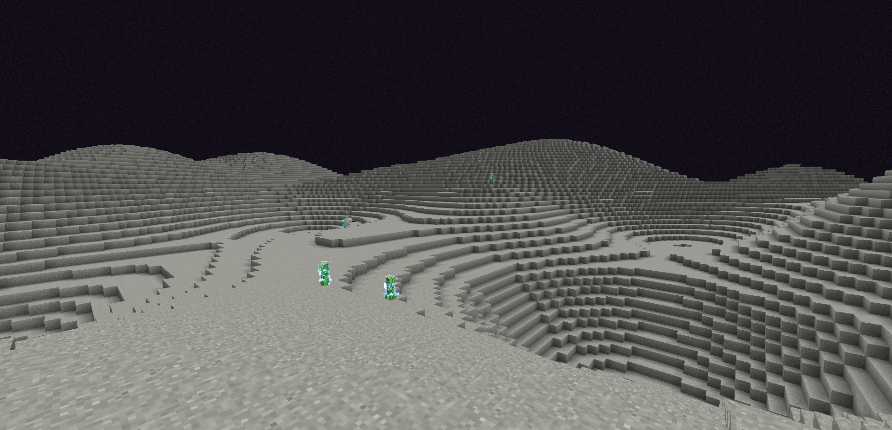

# 月球

**环境：**

- 1 级寒冷

------

**重力：**

- 4 级跳跃提升

------

**生物群系：**

- 恶地

------

**物资：**

- 月球尘埃：在地表，原型为淡灰色混凝土粉末。
- 月岩：在地下，可以用磨石制作成月球尘埃。
- 金矿石：在地下，开采后，会掉落月球芝士。
- 月球芝士：可以吃，恢复 2 饥饿值和 2 饱和度。

------

**生物：**

- 月牛：每过 5 分钟也会掉落一个月球芝士。
- 变异苦力怕：原型为闪电苦力怕，击杀掉落芒粉 (可用于合成二阶化工火箭)

------

