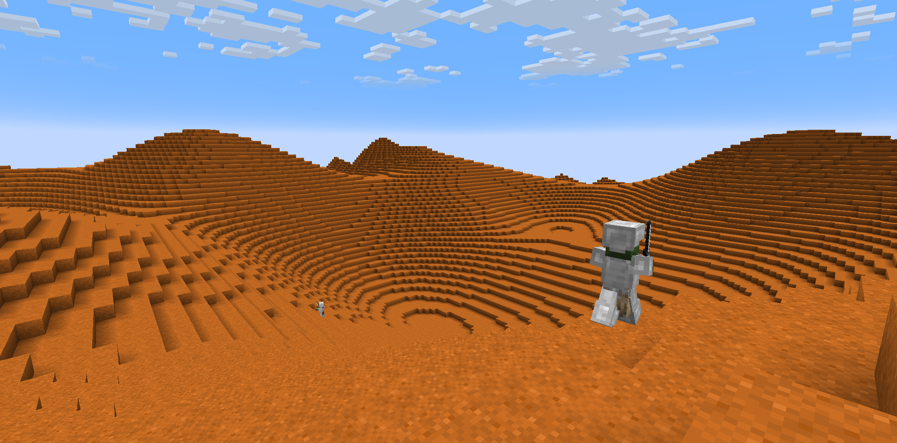

# 火星

**环境：**

- 94.9% 二氧化碳，2.6% 氮气，1.6% 氩气
- 2 级寒冷

**重力：**

- 2 级跳跃提升

**生物群系：**

- 沙漠

**物资：**

- 火星尘埃：在地表，原型为红沙

- 火星岩：在地下，火星岩用磨石制作成火星尘埃

- 铁矿石：在地下(Y＜16)

- 干冰：在地下 (可用于合成空间冷却器)

- 陨星：在地表，原型是远古残骸

- 钨锭：用钢筋板跟火星土著换取，或烧陨星

**生物：**

- 火星土著：原型是僵尸村民，击杀掉落 2 个铁锭和 1 个红沙。还可以用钢筋板跟他换取**钨锭**