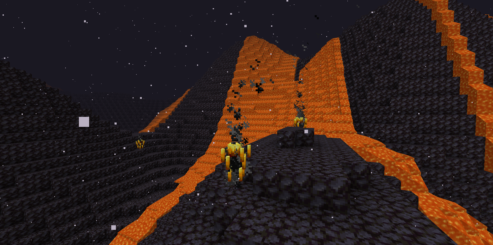

# 金星

**环境：**

- 96.5% 二氧化碳，3.5% 氮气
- 10 级炎热

------

**重力：**

- 0 级跳跃提升

------

**生物群系：**

- 玄武岩三角洲

------

**物资：**

- **硫磺块**：Y=8，原型为淡灰色混凝土粉末。用磨石可制成9个硫酸盐
- **透气石**：看到山顶的岩浆没。在岩浆源的正下方会有7个（可用于制作火山锭）

------

**生物：**

- **烈焰风暴**：原型为烈焰人，他的火球落地后会有闪电
- **天空鲸**：原型为幻翼，可以右键骑在他身上，击杀掉落20个幻翼膜

------

