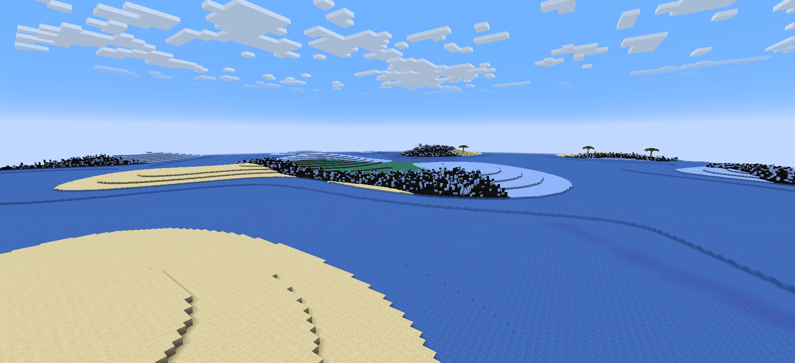

# 土卫六-泰坦

**环境：**

- 97% 氮气，2.7% 甲烷，0.2% 碳氢化合物，0.1% 氢气
- 6级寒冷

------

**重力：**

- 5 级跳跃提升

------

**生物群系：**

- 地表由诡异菌岩和绯红菌岩组成的森林
- 地表由诡异菌岩组成，会下雪的森林
- 沙漠
- 冰刺之地
- 地表为煤块的森林

------

**物资：**

- 甲烷冰：在地表的湖泊下
- 激光矿石：在Y＜41的地方

------

**生物：**

- 天空鲸：原型为幻翼，可以右键骑在他身上，击杀掉落20个幻翼膜

- 水蛭：原型为蠹虫，在攻击玩家时，有50%的概率会吞掉玩家随机一个物品栏的物品。击杀会掉落他吞掉的物品

- 泰坦人：原型为幻术师

- 泰坦王：原型为唤魔者

  召唤恼鬼时 会额外召唤 3 只水蛭 （一样50%概率吞你物品栏的物品）

  召唤尖牙时 会获得 5 秒隐身

  免疫所有弹射物所造成的伤害

  

------

