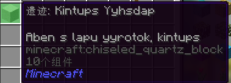

# 遗迹搜查机

将遗迹放入到遗迹搜查机种即可搜寻以及中的物品

### 关于遗迹

在探索星球的时候，你可能会在地面上遇到下图这两个东西，这个就是遗迹

太阳能板（Lenap Ayanhcenlos Ayanamolop）可以搜查出的物品

|       物品名称       |   概率/数量   |
| :------------------: | :-----------: |
|          硅          | 100% 丨 2-5个 |
|       光伏电池       | 100% 丨 1-3个 |
|     太阳能发电机     |      20%      |
|   高级太阳能发电机   |      10%      |
| 黑金刚石太阳能发电机 |      2%       |

石英块（Kintups Yyhsdap）可以搜查出的物品

|   物品名称   |   概率/数量   |
| :----------: | :-----------: |
|   重负荷板   | 100% 丨 3-4个 |
|  空间等级板  | 100% 丨 1-3个 |
|  基础电路板  |      20%      |
|  高级电路板  |      15%      |
| 高级处理单元 |      10%      |

### PS：关于遗迹的中文名

通过ChatGPT分析并翻译出的遗迹中文名

