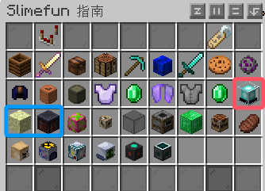
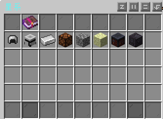
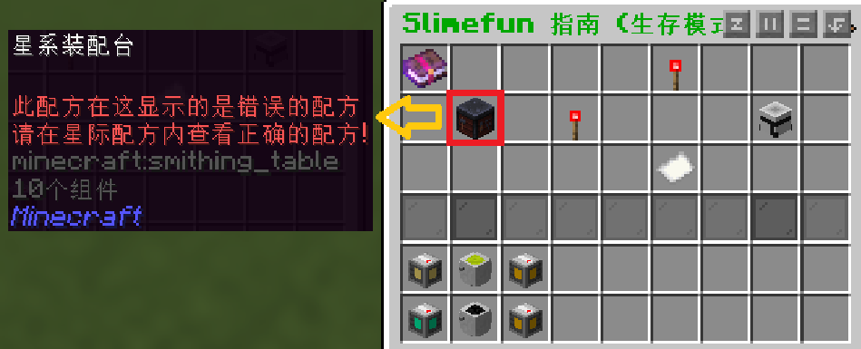
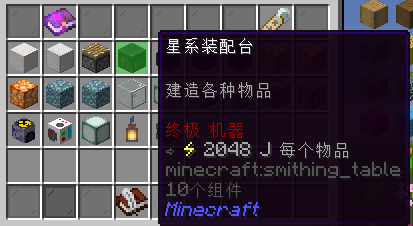

# **星际科技**

这里粘液科技-附属插件-星际科技的教程，此教程由`GardeniaBlow-紫薯` 编辑

学习过程中如有疑问，请QQ群内咨询 [902294518](https://qm.qq.com/q/t0CAd0mWf6)

------

星际科技（Galacifun），是粘液科技的一个附属插件。

------

**在正式开始教程前 请您务必读完下面的内容**

在粘液书中我们可以看到有三个关于星际科技的子目录（星系、宇宙、星系配方）

("宇宙"和"星系配方"在"星系目录"里面也有) 

所以，所有关于星系的内容，在“星系”目录中都能找到

### 关于星系配方

在查看物品配方的时候，请您注意左边使用的合成工作方块是否为[星系装配台](machine/4.md)

如果是，则需前往子目录"星系配方"查看完整且正确的配方

[星系装配台](machine/4.md)是专门用于合成星际物品的工作方块，并且需要接入[能源网络](../1.4.md)才可使用

所在目录：星系→星系机器

