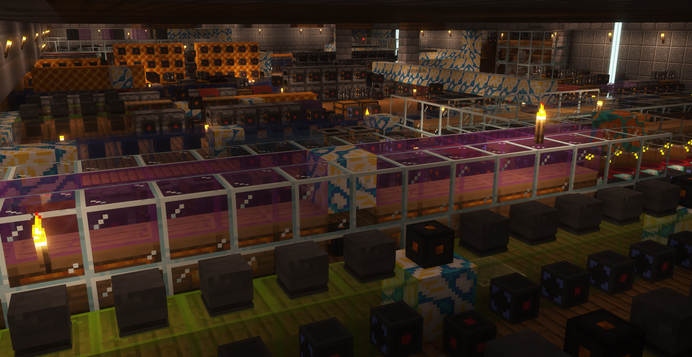

## Slimefun-粘液科技是什么

Slimefun是一个 Bukkit 插件，可以向服务器提供模组级体验

Slimefun向原版 Minecraft 服务器添加超过 400 种物品和方

------

您不需要在客户端做任何修改，只需使用原版Minecraft进入服务器，即可享受Slimefun

使用粘液科技可以实现多种物品的自动化生产

**下图来自服务器玩家Wish_sw的工业区**

