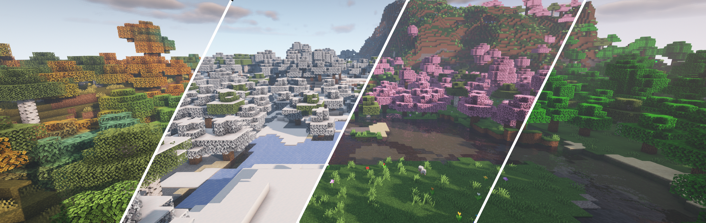

# 2022/4/11 维护内容

* **走在地毯和半砖上将不会出现回弹的情况**
* **禁用绑定诅咒附魔**
* **机器限制改为128个，且多个种类不会相互影响，增加上限提示**
* **优化了刷怪过多造成的服务器延迟**
* **删除了客户端优化功能(关闭粒子显示等)**

## **加入四季和温度系统**

### 日历

日历系统就像现实生活一样，每月的天数与现实相同，每年365天，唯一的区别是使用Minecraft天数而不是真实天数。Minecraft一天有20分钟，这意味着一整年大约需要5天。

### **时间**

四个季节拥有不同的昼夜长短，各个normal世界(新旧生存世界，资源世界，主城)同步昼夜时间和季节。

### 四季

#### 春天

春天是最为轻松的季节，它会给你的世界带来生机勃勃和温暖的感觉。

* 春季从3月4日开始
* 森林中的叶子会变成粉红色，谁会带有轻微的淡蓝色调
* 天空是淡蓝色的
* 到处都是鲜花，整个世界就像一片花海
* 冬季产生的冰雪将会融化
* 大量的羊、牛、猪、兔子和鸡会繁殖
* 提高蜜蜂的产卵率
* 白天和黑夜的长度大多是相等的
* 平均温度为5℃\~23℃，具体取决于生物群落

#### 夏天

白天越来越长，太阳非常浓烈。世界正在变成一个大丛林，请随身携带一些水来克服炎热。

* 夏季从6月4日开始
* 大多数生物群落中的数目和草都具有类似于丛林树叶的鲜绿色
* 寒冷的生物群落具有平原的草色
* 炎热的生物群落看起来有点干燥
* 水和天空的颜色是浅蓝色
* 到处都是浆果丛
* 降水会减少
* 通常在丛林中生成的动物现在可以在任何地方生成
* 作物/植物会以2倍的速度生长
* 会生成尸壳而不是僵尸
* 白天会很长，夜晚会很短
* 平均温度为25℃\~40℃，具体取决于生物群落

#### 秋天

白天变短了，太阳也不再热烈。树木变成美丽的颜色，地面变得泥泞起来。狐狸、哞菇、蝙蝠和洞穴蜘蛛开始出现在世界各地，森林从未如此美丽！

* 秋季从9月4日开始
* 树木变成各种颜色：橙色、蓝色、绿色、黄色和棕色
* 草呈浅褐色泥状
* 天空是灰色的
* 水是棕色的，看起来很浑浊
* 出现大片蘑菇
* 会经常下雨和雷暴
* 蝙蝠在夜间在地面生成。
* 哞菇和狐狸随处可见
* 晚上可以找到额外的蜘蛛，有时甚至是洞穴蜘蛛
* 生物有20%的几率生成时头上有南瓜
* 白天和黑夜的长度大多是相等的
* 夏季产生的浆果丛被移除
* 平均温度在5℃\~25℃，具体取决于生物群落

#### 冬天

气温正在下降，生存正在成为一个真正的挑战。大多数植物死于寒冷的雪中，幸存下来的植物无法生长。湖泊和河流结冰，游泳可能是致命的。水是深蓝色的，树木和草是浅灰色的。熬过漫长而寒冷的夜晚确实是一项挑战。

* 冬季从12月4日开始
* 叶子和草有浅灰色调
* 天空更白了一点
* 水是深蓝色的
* 所有露天的水将会结冰
* 天气会下雪而不是下雨，雪季后会移除积雪
* 夜晚会很长，白天会很短
* 狼、白狐、北极熊和雪人随处可见
* 会生成流髑而不是骷髅
* 露天的植物/作物将不会生长
* 平均温度在-10℃\~5℃，具体取决于生物群落

### 温度

采用了最为先进的温度系统之一，它设计的目的是不会过多的影响游戏玩法，因此不会令人讨厌。每个玩家的物品栏上都会显示一个环境温度。

很多事情都会改变玩家的温度：季节、生物群落、盔甲、天气、时间、水、食物、疾跑、光线等等。

玩家将因体温过低而受到处罚，效果从 -10 ℃ 和 50 ℃ 开始。效果包括饥饿、迟缓、冰冻(伤害)、禁止治疗和燃烧。
